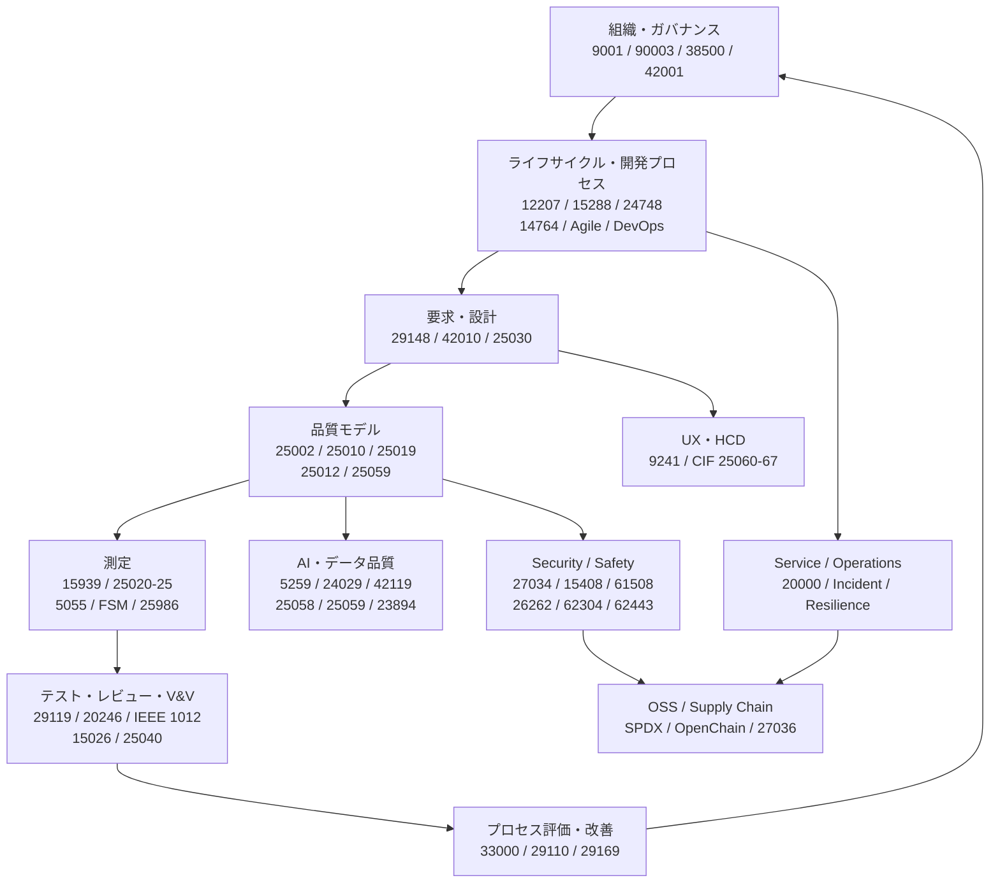
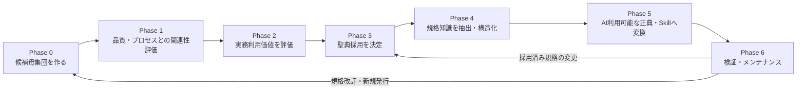
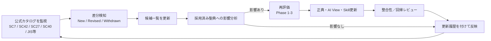
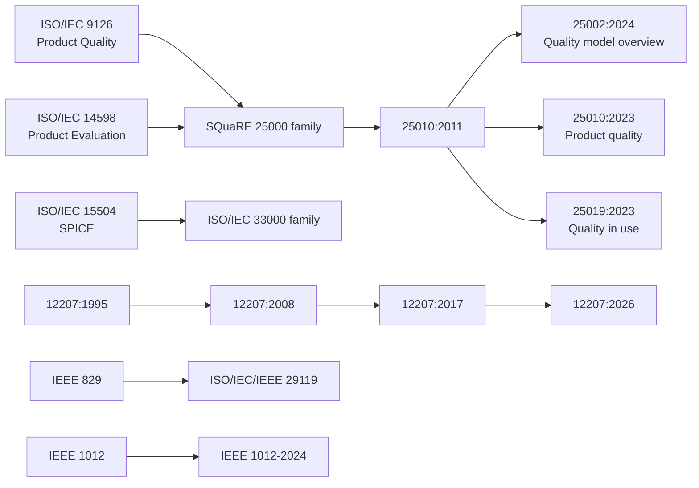

# ソフトウェア品質・ソフトウェアプロセス 国際規格 聖典候補一覧
## Canon Candidate Inventory — Phase 0 Baseline (Accepted) 2026-08-15

> **位置づけ**
>
> 本文書は、ソフトウェア品質・ソフトウェアプロセスの実務、教育、規格選定、AI活用において、
> 将来「聖典（正典）」として採用する可能性がある国際規格を、**まず広く収集するための候補インベントリ**である。
> 本文書に掲載された規格が、そのまま採用済み聖典であることを意味しない。
>
> この段階（Phase 0）では、偽陰性（必要な規格を落とすこと）を偽陽性（後で不要と判断する候補を含めること）より重く扱う。
> 候補の実務価値・重複・適用範囲・採用可否は、後続フェーズで評価する。
>
> **基準日:** 2026-08-15

---

# 1. エグゼクティブサマリー

1. 本書の目的は「最終的に使う規格だけを選ぶこと」ではなく、**正典化を検討すべき規格候補の母集団を作ること**である。
2. 候補は `Core候補 / Relevant候補 / Adjacent候補 / Historical` に暫定分類するが、これは採用判定ではない。
3. 中核候補はSQuaRE 25000系、12207/15288、29119、33000、15939、29148、20246、15026等で構成される。
4. AI品質は25058/25059だけでなく、SC 42の5259、24029、42119、risk、safety、bias、explainability等を横断する。
5. Security/Safety、UX/HCD、Service Management、OSS/Supply Chainは品質の隣接領域として候補に残す。
6. 廃止規格は、9126/14598/15504/IEEE 829等、**現在体系を理解するうえで系譜上重要なものを選択的に収録**する。
7. 最終ゲート監査までに、ISO/IEC 25986、20741、29110の新パート、20000のAgile/DevOps・AI関連パート、SC42の24668/42007/42102/42103等を追加した。
8. 各レコードに「**何を対象とする規格か**」を日本語で追記し、次フェーズの選別をしやすくした。
9. 本書は規格本文の代替ではない。採用候補を決めた後、公開情報と必要に応じて正式本文から概念・要求・プロセスを抽出する。
10. 維持管理は、公式カタログ差分検知 → 候補更新 → 影響評価 → 正典再評価、という循環で運用する。

---

# 2. 候補一覧のスコープと判定原則

## 2.1 調査母集団

候補探索は、以下を主要な母集団とする。

- ISO/IEC JTC 1/SC 7: Software and systems engineering
- ICS 35.080: Software
- ISO/IEC JTC 1/SC 42: Artificial intelligence
- ISO/IEC JTC 1/SC 27: Information security, cybersecurity and privacy protection
- ISO/IEC JTC 1/SC 40: IT service management and IT governance
- ISO/TC 176: Quality management and quality assurance
- ISO/TC 159/SC 4: Ergonomics of human-system interaction
- IEC/IEEEおよびドメイン固有規格のうち、Software Quality / Process / V&V / Safety / Securityとの接続が強いもの
- **SC42の収録境界:** 品質モデル、品質評価、テスト、V&V、データ品質、risk、reliability、robustness、resilience、bias、explainability、transparency、human oversight、AI lifecycle/process等、ソフトウェア／AI品質へ直接接続する規格を候補対象とする。一般的なAI vocabulary、reference architecture、use-case catalogue、汎用的な概念整理のみを目的とする規格は、品質・プロセスへの直接接続が別途確認できない限りPhase 0の対象外とする。

## 2.2 候補区分

| 区分 | 意味 | Phase 0での扱い |
|---|---|---|
| **Core候補** | ソフトウェア品質・品質活動・主要プロセスを直接定義する | 原則残す |
| **Relevant候補** | 品質活動やソフトウェアプロセスを直接支援する | 残してPhase 1で評価 |
| **Adjacent候補** | 特定の文脈で品質へ強く接続する隣接領域 | 落とさずPhase 1/2で判断 |
| **Historical** | 現在の適用規格ではないが、系譜・概念理解に重要 | 現行規格として使わない |

> **注意:** 候補区分は暫定ラベルである。Phase 1以降で変更可能。

## 2.3 収録方針

- 現行規格だけでなく、近く発行されるFDIS/DIS/CD/AWI等も将来候補として保持する。
- ただし策定中規格を「現行の規範」として使用しない。
- Historicalは**全edition履歴を網羅することを目的としない**。現在体系の理解に必要な主要系譜のみ残す。
- 迷うものはPhase 0では残し、Phase 1で落とす。
- 規格本文が有料の場合、本書では公開metadata・abstractを超えて内容を捏造しない。

---

# 3. ソフトウェア品質規格の全体像

## 3.1 目的別の入口

| やりたいこと | 主な入口候補 |
|---|---|
| 品質特性を定義する | ISO/IEC 25010, 25019 |
| 品質要求を作る | ISO/IEC 25030, ISO/IEC/IEEE 29148 |
| 品質を測る | ISO/IEC/IEEE 15939, 25020-25, 5055 |
| テストプロセスを設計する | ISO/IEC/IEEE 29119 |
| レビューを設計する | ISO/IEC 20246 |
| V&V / Assuranceを設計する | IEEE 1012, ISO/IEC/IEEE 15026 |
| 開発・保守プロセスを設計する | ISO/IEC/IEEE 12207, ISO/IEC 14764 |
| Agile/DevOpsへ接続する | 32675, 33202, 24587, 20000-15 |
| プロセス改善・能力評価を行う | ISO/IEC 33000 family |
| 小規模組織向けに軽量化する | ISO/IEC 29110 family |
| AI品質を扱う | 25058, 25059, 5259, 24029, 42119 |
| UX/HCDを扱う | ISO 9241 family, CIF 25060-67 |
| AppSec / Security Assuranceを扱う | 27034, 15408/18045, 27036 |
| SBOM / OSS Supply Chainを扱う | 5962 SPDX, 5230/18974 OpenChain |

---

# 4. 聖典化までのフェーズ

## Phase 0 — Candidate Discovery / Inventory

**目的:** 必要な規格を取りこぼさない候補母集団を作る。  
**今回の本文書が担当するフェーズ。**

実施内容:
- SC/TC/ICSカタログをスイープ
- 現行、策定中、重要なHistoricalを登録
- 規格familyの隣接partを確認
- 各候補の「対象」を一文で付与
- 明確に無関係なもの以外は保守的に残す

成果物:
- 聖典候補一覧
- 系譜図
- 調査source一覧
- 追加発見／status更新履歴

完了条件:
- 指定母集団を一巡
- 明白なcandidate familyの部分収録を解消
- 迷う項目を削除せずPhase 1へ渡せる状態

## Phase 1 — Relevance Assessment

**目的:** ソフトウェア品質・ソフトウェアプロセスとの接続を評価する。

各候補を以下で評価する。

- 品質モデルを提供するか
- 要求・測定・評価・テスト・レビュー・V&Vの根拠になるか
- ライフサイクルやプロセス設計の根拠になるか
- QA Architect / Quality Engineerの判断に利用できるか
- AI Skillが判断根拠として参照できるか
- 他の中核規格から依存・参照されるか
- 特定ドメイン限定か、汎用性があるか

成果物:
- `Core / Relevant / Adjacent / Out-of-scope` の確定
- 各規格の採用検討理由

## Phase 2 — Practical Applicability Assessment

**目的:** 「関係する」だけでなく、実務で本当に使えるかを評価する。

評価軸:
- 解決できる実務課題
- 適用する開発フェーズ
- 入力／成果物
- 導入コスト
- 規範性（requirements / guidance / model / vocabulary等）
- 他規格との重複
- Agile/DevOps/AI開発との適合性
- ツール／自動化との相性
- 組織規模・ドメイン制約
- 更新頻度・陳腐化リスク

成果物:
- 実務利用マトリクス
- 優先順位
- 「採用候補 / 保留 / 参照のみ」の判断材料

## Phase 3 — Canon Selection

**目的:** 実際に聖典へ採用する規格を決める。

判断:
- Adopt: 正典の根拠として採用
- Reference: 補助参照
- Domain Canon: 特定domainのみ採用
- Defer: 将来再評価
- Reject: 採用しない

必須:
- 判断理由を残す
- 置換規格・依存規格を確認
- 「ISOだから採用」ではなく実務価値で判断

成果物:
- 採用規格リスト
- Decision log
- 規格間依存マップ

## Phase 4 — Knowledge Extraction

**目的:** 規格番号ではなく、実際に使える知識へ変換する。

抽出対象:
- 目的・scope
- 用語
- concept/model
- process/activity/task
- requirement / recommendation
- input/output
- role
- measure / criterion
- tailoring条件
- 他規格との関係

成果物:
- 正典ドキュメント
- cross-reference
- concept map
- 実務テンプレート候補

## Phase 5 — AI-native Canon / Skills

**目的:** AIが規格を「知っている」だけでなく、正しく利用できるようにする。

実施内容:
- AI向け解釈ビューを作成
- Skill単位に責務を分離
- 必須ルールと推奨事項を区別
- 出典・根拠を保持
- 規格にない事項を規格由来として扱わないguardrailを設ける
- 実行時に再調査すべき領域を明示

成果物例:
- quality-characteristics skill
- test-requirement-analysis skill
- test-design skill
- review skill
- process-assessment skill
- risk / premortem連携
- exploratory testingへの規格／非規格知識の橋渡し

## Phase 6 — Validation & Maintenance

**目的:** 規格改訂で正典が静かに腐る、人類らしい事故を防ぐ。

推奨運用:
- **定期:** 四半期ごとにカタログ差分確認
- **イベント駆動:** 採用規格のrevision / withdrawal / major new standardを検知したら即時再評価
- **Project更新:** 策定中規格のstage変更時は、statusだけでなくreference number / 正式title / document typeもISO公式から再取得
- **AI品質領域:** 変化が速いため、SC42は他領域より短い間隔でもよい
- 更新時は「候補一覧更新」と「採用済み正典更新」を分離する

---

# 5. 主要規格の系譜

**読み方**
- 9126/14598 → SQuaREは1対1の単純置換ではなく再編。
- 25010:2011の内容は25002:2024、25010:2023、25019:2023へ再配置。
- 15504 → 33000もfamily再編として扱う。
- IEEE 829はテスト標準の系譜、IEEE 1012はV&Vの別系譜。

---

# 6. カテゴリ

| Cat | カテゴリ |
|---|---|
| A | プロダクト品質 / SQuaRE |
| B | 測定 / ソースコード品質 / Functional Size |
| C | 品質マネジメント |
| D | ライフサイクル / Architecture / Agile / DevOps / VSE |
| E | プロセスアセスメント・改善 |
| F | テスト / Review / V&V / Assurance |
| G | AI / データ品質 |
| H | Security / Safety |
| I | Usability / UX / HCD |
| J | IT Service / Operations / Governance |
| K | OSS / Supply Chain |

---

# 7. 聖典候補インベントリ

> **「対象」列**は「この規格が何に対しての規格か」を候補選定時に把握するための短い要約であり、
> 正式scopeの代替ではない。正式scopeはPhase 1/2でISO/IEC/IEEE等の本文・公式abstractを確認する。
>
> **「候補区分」列**はPhase 0時点の暫定値であり、採用可否を意味しない。

| 規格 / Project | 対象 | 正式名称 | 年 | 種別 | Status | 候補区分 | 置換・改訂関係 | Cat | 一次情報 |
|---|---|---|---|---|---|---|---|---|---|
| ISO/IEC 9126-1:2001 | 旧ソフトウェア製品品質体系 | Software engineering — Product quality — Part 1: Quality model | 2001 | IS | 廃止 | Historical | SQuaREへ統合・再編（1:1置換ではない） | A | [ISO-SC7] |
| ISO/IEC TR 9126-2:2003 | 旧ソフトウェア製品品質体系 | Software engineering — Product quality — Part 2: External metrics | 2003 | TR | 廃止 | Historical | SQuaREへ統合・再編（1:1置換ではない） | A | [ISO-SC7] |
| ISO/IEC TR 9126-3:2003 | 旧ソフトウェア製品品質体系 | Software engineering — Product quality — Part 3: Internal metrics | 2003 | TR | 廃止 | Historical | SQuaREへ統合・再編（1:1置換ではない） | A | [ISO-SC7] |
| ISO/IEC TR 9126-4:2004 | 旧ソフトウェア製品品質体系 | Software engineering — Product quality — Part 4: Quality in use metrics | 2004 | TR | 廃止 | Historical | SQuaREへ統合・再編（1:1置換ではない） | A | [ISO-SC7] |
| ISO/IEC 14598-1:1999 | 旧ソフトウェア製品評価体系 | Information technology — Software product evaluation — Part 1: General overview | 1999 | IS | 廃止 | Historical | SQuaREへ統合・再編（1:1置換ではない） | A | [ISO-SC7] |
| ISO/IEC 14598-2:2000 | 品質要求・評価活動の計画／管理 | Software engineering — Product evaluation — Part 2: Planning and management | 2000 | IS | 廃止 | Historical | SQuaREへ統合・再編（1:1置換ではない） | A | [ISO-SC7] |
| ISO/IEC 14598-3:2000 | ソフトウェア／システム品質 | Software engineering — Product evaluation — Part 3: Process for developers | 2000 | IS | 廃止 | Historical | SQuaREへ統合・再編（1:1置換ではない） | A | [ISO-SC7] |
| ISO/IEC 14598-4:1999 | ソフトウェア／システム品質 | Software engineering — Product evaluation — Part 4: Process for acquirers | 1999 | IS | 廃止 | Historical | SQuaREへ統合・再編（1:1置換ではない） | A | [ISO-SC7] |
| ISO/IEC 14598-5:1998 | 旧ソフトウェア製品評価体系 | Information technology — Software product evaluation — Part 5: Process for evaluators | 1998 | IS | 廃止 | Historical | SQuaREへ統合・再編（1:1置換ではない） | A | [ISO-SC7] |
| ISO/IEC 14598-6:2001 | 評価モジュールの文書化 | Software engineering — Product evaluation — Part 6: Documentation of evaluation modules | 2001 | IS | 現行 | Relevant候補 | Legacy familyだが現行。SQuaRE移行後も残存し、『14598全廃』は誤り | A | [ISO-14598-6] |
| ISO/IEC 25000:2014 | SQuaRE体系全体 | Systems and software engineering — Systems and software Quality Requirements and Evaluation (SQuaRE) — Guide to SQuaRE | 2014 | IS | 現行 | Core候補 | 旧25000:2005を置換。25000 multipart再編プロジェクト進行中 | A | [ISO-SC7] |
| ISO/IEC CD 25000-11.2 | ソフトウェア／システム品質 | Information technology — Systems and software Quality Requirements and Evaluation (SQuaRE) — Part 11: IT service quality model | — | CD | 策定中 | Relevant候補 | TS 25011:2017の後継方向 | A | [ISO-SC7] |
| ISO/IEC CD 25000-22 | ソフトウェア／システム品質 | Systems and software engineering — Systems and software Quality Requirements and Evaluation (SQuaRE) — Part 22: Measurement of quality-in-use | — | CD | 策定中 | Relevant候補 | 25022:2016改訂方向 | A | [ISO-SC7] |
| ISO/IEC DIS 25000-2 | ソフトウェア／システム品質 | Systems and software engineering — Systems and software Quality Requirements and Evaluation (SQuaRE) — Part 2: Vocabulary | — | DIS | 策定中 | Relevant候補 | 25000 family再編 | A | [ISO-SC7] |
| ISO/IEC DIS 25000-23 | 製品品質の測定 | Systems and software engineering — Systems and software Quality Requirements and Evaluation (SQuaRE) — Part 23: Measurement of product quality | — | DIS | 策定中 | Relevant候補 | 25023:2016改訂方向 | A | [ISO-SC7] |
| ISO/IEC/IEEE CD 25000-70.3 | ソフトウェア／システム品質 | Systems and software engineering — Systems and software Quality Requirements and Evaluation (SQuaRE) — Part 70: Quality engineering framework | — | CD | 策定中 | Relevant候補 | 追加発見 | A | [ISO-SC7] |
| ISO/IEC 25001:2014 | 品質要求・評価活動の計画／管理 | Systems and software engineering — Systems and software Quality Requirements and Evaluation (SQuaRE) — Planning and management | 2014 | IS | 現行 | Core候補 | 旧25001:2007を置換 | A | [ISO-SC7] |
| ISO/IEC 25002:2024 | 品質モデルの共通体系・利用方法 | Systems and software engineering — Systems and software Quality Requirements and Evaluation (SQuaRE) — Quality model overview and usage | 2024 | IS | 現行 | Core候補 | 25010:2011の一般モデル部分を再編 | A | [ISO-SC7] |
| ISO/IEC 25010:2011 | ソフトウェア／システム品質 | Systems and software engineering — Systems and software Quality Requirements and Evaluation (SQuaRE) — System and software quality models | 2011 | IS | 廃止 | Historical | 25002:2024 + 25010:2023 + 25019:2023へ再編 | A | [ISO-SC7] |
| ISO/IEC 25010:2023 | システム／ソフトウェア製品品質モデル | Systems and software engineering — Systems and software Quality Requirements and Evaluation (SQuaRE) — Product quality model | 2023 | IS | 現行 | Core候補 | 25010:2011を25002/25010/25019へ再編 | A | [ISO-SC7] |
| ISO/IEC TS 25011:2017 | ITサービス品質モデル | Information technology — Systems and software Quality Requirements and Evaluation (SQuaRE) — Service quality models | 2017 | TS | 現行（改訂予定） | Relevant候補 | 25000-11系の後継作業あり | A | [ISO-SC7] |
| ISO/IEC 25012:2008 | データ品質モデル | Software engineering — Software product Quality Requirements and Evaluation (SQuaRE) — Data quality model | 2008 | IS | 現行 | Core候補 | — | A | [ISO-SC7] |
| ISO/IEC 25019:2023 | 利用時品質モデル | Systems and software engineering — Systems and software Quality Requirements and Evaluation (SQuaRE) — Quality-in-use model | 2023 | IS | 現行 | Core候補 | 25010:2011から利用時品質を分離 | A | [ISO-SC7] |
| ISO/IEC 25020:2019 | 品質測定の枠組み | Systems and software engineering — Systems and software Quality Requirements and Evaluation (SQuaRE) — Quality measurement framework | 2019 | IS | 現行 | Core候補 | 25020:2007を置換 | A | [ISO-SC7] |
| ISO/IEC 25021:2012 | 品質測定要素 | Systems and software engineering — Systems and software Quality Requirements and Evaluation (SQuaRE) — Quality measure elements | 2012 | IS | 現行 | Core候補 | — | A | [ISO-SC7] |
| ISO/IEC 25022:2016 | 利用時品質の測定 | Systems and software engineering — Systems and software Quality Requirements and Evaluation (SQuaRE) — Measurement of quality in use | 2016 | IS | 現行（改訂中） | Core候補 | 25000-22系の改訂作業 | A | [ISO-SC7] |
| ISO/IEC 25023:2016 | 製品品質の測定 | Systems and software engineering — Systems and software Quality Requirements and Evaluation (SQuaRE) — Measurement of system and software product quality | 2016 | IS | 現行（改訂中） | Core候補 | 25000-23系の改訂作業 | A | [ISO-SC7] |
| ISO/IEC 25024:2015 | データ品質の測定 | Systems and software engineering — Systems and software Quality Requirements and Evaluation (SQuaRE) — Measurement of data quality | 2015 | IS | 現行 | Core候補 | — | A | [ISO-SC7] |
| ISO/IEC TS 25025:2021 | ITサービス品質の測定 | Systems and software engineering — Systems and software Quality Requirements and Evaluation (SQuaRE) — Measurement of IT service quality | 2021 | TS | 現行 | Relevant候補 | 追加発見 | A | [ISO-SC7] |
| ISO/IEC 25030:2019 | 品質要求の定義・仕様化 | Systems and software engineering — Systems and software Quality Requirements and Evaluation (SQuaRE) — Quality requirements framework | 2019 | IS | 現行 | Core候補 | 25030:2007を置換 | A | [ISO-SC7] |
| ISO/IEC 25040:2024 | 品質評価の枠組み | Systems and software engineering — Systems and software Quality Requirements and Evaluation (SQuaRE) — Quality evaluation framework | 2024 | IS | 現行 | Core候補 | 25040:2011を置換 | A | [ISO-SC7] |
| ISO/IEC 25041:2012 | 品質評価の実施ガイド | Systems and software engineering — Systems and software Quality Requirements and Evaluation (SQuaRE) — Evaluation guide for developers, acquirers and independent evaluators | 2012 | IS | 現行 | Core候補 | — | A | [ISO-SC7] |
| ISO/IEC 25045:2010 | 回復性の品質評価 | Systems and software engineering — Systems and software Quality Requirements and Evaluation (SQuaRE) — Evaluation module for recoverability | 2010 | IS | 現行 | Relevant候補 | — | A | [ISO-SC7] |
| ISO/IEC 25051:2014 | RUSP（既製ソフトウェア製品）の品質要求・試験 | Software engineering — Systems and software Quality Requirements and Evaluation (SQuaRE) — Requirements for quality of Ready to Use Software Product (RUSP) and instructions for testing | 2014 | IS | 現行 | Core候補 | 25051:2006を置換 | A | [ISO-SC7] |
| ISO/IEC TS 25052-1:2022 | クラウドサービス品質 | Systems and software engineering — Systems and software Quality Requirements and Evaluation (SQuaRE) — Cloud services — Part 1: Quality model | 2022 | TS | 現行 | Relevant候補 | 追加発見 | A | [ISO-SC7] |
| ISO/IEC TS 25052-2:2024 | クラウドサービス品質 | Systems and software engineering — Systems and software Quality Requirements and Evaluation (SQuaRE) — Cloud services — Part 2: Quality measurement | 2024 | TS | 現行 | Relevant候補 | 追加発見 | A | [ISO-SC7] |
| ISO/IEC AWI 25058 | ソフトウェア／システム品質 | Systems and software engineering — Systems and software Quality Requirements and Evaluation (SQuaRE) — Measurement and guidance for quality evaluation of AI systems | — | AWI | 策定中 | Relevant候補 | ISO/IEC TS 25058:2024を置換予定 | A/G | [ISO-SC42] |
| ISO/IEC TS 25058:2024 | AIシステムの品質評価 | Systems and software engineering — Systems and software Quality Requirements and Evaluation (SQuaRE) — Guidance for quality evaluation of artificial intelligence (AI) systems | 2024 | TS | 現行（改訂中） | Core候補 | 次版作業あり | A/G | [ISO-SC7] |
| ISO/IEC 25059:2023 | AIシステム品質モデル | Software engineering — Systems and software Quality Requirements and Evaluation (SQuaRE) — Quality model for AI systems | 2023 | IS | 現行（改訂中） | Core候補 | FDIS改訂が進行 | A/G | [ISO-SC7] |
| ISO/IEC FDIS 25059 | AIシステム品質モデル | Software engineering — Systems and software Quality Requirements and Evaluation (SQuaRE) — Quality models for AI systems | — | FDIS | 策定中 | Relevant候補 | ISO/IEC 25059:2023を置換予定 | A/G | [ISO-SC42] |
| ISO/TR 25060:2023 | ユーザビリティ／HCD情報の共通形式（CIF） | Systems and software engineering — Systems and software Quality Requirements and Evaluation (SQuaRE) — General framework for Common Industry Format (CIF) for usability-related information | 2023 | TR | 現行 | Relevant候補 | ISO/IEC TR 25060:2010を置換 | A/I | [ISO-TC159SC4] |
| ISO 25062:2025 | ユーザビリティ／HCD情報の共通形式（CIF） | Systems and software engineering — Systems and software Quality Requirements and Evaluation (SQuaRE) — Common Industry Format (CIF) for reporting usability evaluations | 2025 | IS | 現行 | Relevant候補 | ISO/IEC 25062:2006を置換し、25066の役割を統合 | A/I | [ISO-TC159SC4] |
| ISO/DIS 25063 | ユーザビリティ／HCD情報の共通形式（CIF） | Systems and software engineering — Systems and software product Quality Requirements and Evaluation (SQuaRE) — Common Industry Format (CIF) for usability: Context of use description | — | DIS | 策定中 | Relevant候補 | ISO/IEC 25063:2014を置換予定 | A/I | [ISO-TC159SC4] |
| ISO/IEC 25063:2014 | ユーザビリティ／HCD情報の共通形式（CIF） | Systems and software engineering — Systems and software product Quality Requirements and Evaluation (SQuaRE) — Common Industry Format (CIF) for usability: Context of use description | 2014 | IS | 現行（改訂中） | Relevant候補 | ISO/DIS 25063で改訂中 | A/I | [ISO-TC159SC4] |
| ISO/IEC 25064:2013 | ユーザビリティ／HCD情報の共通形式（CIF） | Systems and software engineering — Software product Quality Requirements and Evaluation (SQuaRE) — Common Industry Format (CIF) for usability: User needs report | 2013 | IS | 現行 | Relevant候補 | — | A/I | [ISO-TC159SC4] |
| ISO 25065:2019 | ユーザビリティ／HCD情報の共通形式（CIF） | Systems and software engineering — Software product Quality Requirements and Evaluation (SQuaRE) — Common Industry Format (CIF) for Usability: User requirements specification | 2019 | IS | 現行 | Relevant候補 | — | A/I | [ISO-TC159SC4] |
| ISO/IEC 25066:2016 | ユーザビリティ／HCD情報の共通形式（CIF） | Systems and software engineering — Systems and software Quality Requirements and Evaluation (SQuaRE) — Common Industry Format (CIF) for Usability — Evaluation Report | 2016 | IS | 廃止 | Historical | ISO 25062:2025側へ統合 | A/I | [ISO-TC159SC4] |
| ISO/CD 25067 | ユーザビリティ／HCD情報の共通形式（CIF） | Systems and software engineering — Software product quality Requirements and Evaluation (SQuaRE) — Common Industry Format (CIF) for Usability: Design specification of user-system interaction and user interface | — | CD | 策定中 | Relevant候補 | 新規 | A/I | [ISO-TC159SC4] |
| ISO/IEC 5055:2021 | 自動ソースコード品質測定 | Information technology — Software measurement — Software quality measurement — Automated source code quality measures | 2021 | IS | 現行 | Core候補 | CISQ由来。レビューサイクル対象 | B | [ISO-5055] |
| ISO/IEC 14143-1:2007 | ソフトウェア機能規模測定 | Information technology — Software measurement — Functional size measurement — Part 1: Definition of concepts | 2007 | IS | 現行 | Relevant候補 | FSM framework | B | [ISO-FSM] |
| ISO/IEC 14143-2:2011 | ソフトウェア機能規模測定 | Information technology — Software measurement — Functional size measurement — Part 2: Conformity evaluation of software size measurement methods to ISO/IEC 14143-1 | 2011 | IS | 現行 | Relevant候補 | FSM framework | B | [ISO-FSM] |
| ISO/IEC 14143-6:2012 | ソフトウェア機能規模測定 | Information technology — Software measurement — Functional size measurement — Part 6: Guide for use of ISO/IEC 14143 series and related International Standards | 2012 | IS | 現行 | Relevant候補 | FSM framework | B | [ISO-FSM] |
| ISO/IEC TR 14143-3:2003 | ソフトウェア機能規模測定 | Information technology — Software measurement — Functional size measurement — Part 3: Verification of functional size measurement methods | 2003 | TR | 現行 | Relevant候補 | FSM framework | B | [ISO-FSM] |
| ISO/IEC TR 14143-4:2002 | ソフトウェア機能規模測定 | Information technology — Software measurement — Functional size measurement — Part 4: Reference model | 2002 | TR | 現行 | Relevant候補 | FSM framework | B | [ISO-FSM] |
| ISO/IEC TR 14143-5:2004 | ソフトウェア機能規模測定 | Information technology — Software measurement — Functional size measurement — Part 5: Determination of functional domains for use with functional size measurement | 2004 | TR | 現行 | Relevant候補 | FSM framework | B | [ISO-FSM] |
| ISO/IEC/IEEE 15939:2017 | システム／ソフトウェア測定プロセス | Systems and software engineering — Measurement process | 2017 | IS | 現行（Confirmed / Stage 90.93） | Core候補 | 2022年にsystematic reviewを完了し現行版として確認済み | B | [ISO-15939] |
| ISO/IEC 15940:2013 | ソフトウェア工学環境（SEE）サービス | Systems and software engineering — Software Engineering Environment Services | 2013 | IS | 現行（To be revised / Stage 90.92） | Relevant候補 | software/system processを支援・自動化するSoftware Engineering Environment services | D | [ISO-15940-2013] |
| ISO/IEC CD 15940 | ソフトウェア工学環境（SEE）サービス | Systems and software engineering — Software engineering environment services | — | CD | 策定中（Edition 3 / Stage 30.60） | Relevant候補 | ISO/IEC 15940:2013を置換予定 | D | [ISO-15940-CD] |
| ISO/IEC 19761:2011 | ソフトウェア機能規模測定 | Software engineering — COSMIC: A functional size measurement method | 2011 | IS | 現行 | Relevant候補 | 14143 family準拠FSMM | B | [ISO-FSM] |
| ISO/IEC 20926:2009 | ソフトウェア機能規模測定 | Software and systems engineering — Software measurement — IFPUG functional size measurement method | 2009 | IS | 現行 | Relevant候補 | 14143 family準拠FSMM | B | [ISO-FSM] |
| ISO/IEC 20968:2002 | ソフトウェア測定 | Software engineering — Mk II Function Point Analysis — Counting Practices Manual | 2002 | IS | 現行 | Relevant候補 | 14143 family準拠FSMM | B | [ISO-FSM] |
| ISO/IEC 24570:2018 | ソフトウェア機能規模測定 | Software engineering — NESMA functional size measurement method — Definitions and counting guidelines for the application of Function Point Analysis | 2018 | IS | 現行 | Relevant候補 | 14143 family準拠FSMM | B | [ISO-FSM] |
| ISO/IEC 25986 | ソフトウェア機能規模測定 | Software engineering — NESMA functional size measurement method — Easy functional sizing (EFS) | 2026 | IS | 策定中（Under publication / Stage 60.00） | Relevant候補 | NESMA Easy Functional Sizing。2026-08-15時点で発行準備中 | B | [ISO-25986] |
| ISO/IEC 29155-1:2017 | ITプロジェクト性能ベンチマーキング | Systems and software engineering — Information technology project performance benchmarking framework — Part 1: Concepts and definitions | 2017 | IS | 現行 | Relevant候補 | 追加発見 | B | [ISO-SC7] |
| ISO/IEC 29155-2:2013 | ITプロジェクト性能ベンチマーキング | Systems and software engineering — Information technology project performance benchmarking framework — Part 2: Requirements for benchmarking | 2013 | IS | 現行 | Relevant候補 | 追加発見 | B | [ISO-SC7] |
| ISO/IEC 29155-3:2015 | ITプロジェクト性能ベンチマーキング | Systems and software engineering — Information technology project performance benchmarking framework — Part 3: Guidance for reporting | 2015 | IS | 現行 | Relevant候補 | 追加発見 | B | [ISO-SC7] |
| ISO/IEC 29155-4:2016 | ITプロジェクト性能ベンチマーキング | Systems and software engineering — Information technology project performance benchmarking framework — Part 4: Guidance for data collection and maintenance | 2016 | IS | 現行 | Relevant候補 | 追加発見 | B | [ISO-SC7] |
| ISO/IEC 29881:2010 | ソフトウェア機能規模測定 | Information technology — Systems and software engineering — FiSMA 1.1 functional size measurement method | 2010 | IS | 現行 | Relevant候補 | 14143 family準拠FSMM | B | [ISO-FSM] |
| ISO/IEC TS 30103:2015 | 製品品質達成のためのライフサイクルプロセス適用 | Software and systems engineering — Lifecycle processes — Framework for Product Quality Achievement | 2015 | TS | 現行 | Relevant候補 | 追加発見 | B | [ISO-SC7] |
| ISO/IEC 30130:2016 | ソフトウェアテスト | Software engineering — Capabilities of software testing tools | 2016 | IS | 現行 | Relevant候補 | 追加発見 | B/F | [ISO-SC7] |
| ISO/IEC/IEEE FDIS 30982 | ソフトウェア側面のDependability測定 | Software engineering — Standard for measures of the software aspects of dependability | — | FDIS | 策定中（Stage 50.20） | Relevant候補 | software aspects of dependabilityのmeasuresを標準化 | B | [ISO-30982] |
| ISO/IEC/IEEE 32430:2025 | ソフトウェア非機能規模測定 | Software engineering — Software non-functional size measurement | 2025 | IS | 現行 | Relevant候補 | 追加発見 | B | [ISO-32430] |
| ISO 9000:2026 | 品質マネジメントの基本概念・用語 | Quality management — Fundamentals and vocabulary | 2026 | IS | 現行 | Relevant候補 | 旧2015版を置換 | C | [ISO-TC176] |
| ISO 9001 (Edition 6) | 組織の品質マネジメントシステム（QMS） | Quality management systems — Requirements | 2026 | IS | 策定中（Under publication / Stage 60.00） | Relevant候補 | Edition 6。2026-09発行予定。ISO 9001:2015 + Amd 1:2024を置換予定 | C | [ISO-9001-ED6] |
| ISO 9001:2015 + Amd 1:2024 | 組織の品質マネジメントシステム（QMS） | Quality management systems — Requirements | 2015 | IS+Amd | 現行（後継Edition 6がUnder publication） | Relevant候補 | Edition 6は2026-09発行予定 / Stage 60.00 | C | [ISO-TC176] |
| ISO 10005:2018 | 品質計画 | Quality management — Guidelines for quality plans | 2018 | IS | 現行 | Adjacent候補 | softwareを含むproduct categoryへ適用可能 | C | [ISO-TC176] |
| ISO 10006:2017 | プロジェクト品質マネジメント | Quality management — Guidelines for quality management in projects | 2017 | IS | 現行 | Adjacent候補 | project quality management | C | [ISO-TC176] |
| ISO 10007:2017 | 構成管理 | Quality management — Guidelines for configuration management | 2017 | IS | 現行（改訂予定） | Adjacent候補 | configuration management | C | [ISO-TC176] |
| ISO/IEC/IEEE 90003:2018 | ISO 9001のソフトウェア開発・保守への適用 | Software engineering — Guidelines for the application of ISO 9001:2015 to computer software | 2018 | IS | 現行 | Relevant候補 | ガイダンス。独立の認証要求規格ではない | C | [ISO-TC176] |
| ISO/IEC TR 7052:2023 | カスタムソフトウェア開発・保守のリスク管理 | Software engineering — Controlling frequently occurring risks during development and maintenance of custom software | 2023 | TR | 現行 | Relevant候補 | 追加発見 | D | [ISO-SC7] |
| ISO/IEC 9837:2026 | システムレジリエンス | Systems and software engineering — Systems resilience concepts | 2026 | IS | 現行 | Relevant候補 | 追加発見 | D | [ISO-SC7] |
| ISO/IEC CD TR 29837 | 情報システムレジリエンス | Systems and software engineering — Information systems resilience | — | CD/TR | 策定中（Stage 30.00） | Relevant候補 | information systems resilienceの概念・検討事項を扱うSC7 project | D | [ISO-29837] |
| ISO/IEC 12207:1995 | ソフトウェアライフサイクルプロセス | Information technology — Software life cycle processes | 1995 | IS | 廃止 | Historical | 2008版等へ改訂 | D | [ISO-SC7] |
| ISO/IEC/IEEE 12207-2:2020 | ソフトウェアライフサイクルプロセス | Systems and software engineering — Software life cycle processes — Part 2: Relation and mapping between ISO/IEC/IEEE 12207:2017 and ISO/IEC 12207:2008 | 2020 | IS | 現行 | Relevant候補 | 版間マッピング | D | [ISO-SC7] |
| ISO/IEC/IEEE 12207:2008 | ソフトウェアライフサイクルプロセス | Systems and software engineering — Software life cycle processes | 2008 | IS | 廃止 | Historical | 2017版へ置換 | D | [ISO-SC7] |
| ISO/IEC/IEEE 12207:2017 | ソフトウェアライフサイクルプロセス | Systems and software engineering — Software life cycle processes | 2017 | IS | 廃止 | Historical | 12207:2026へ置換 | D | [ISO-SC7] |
| ISO/IEC/IEEE 12207:2026 | ソフトウェアライフサイクルプロセス | Systems and software engineering — Software life cycle processes | 2026 | IS | 現行 | Core候補 | 12207:2017を置換 | D | [ISO-SC7] |
| ISO/IEC 14764:2022 | ソフトウェアライフサイクルプロセス | Software engineering — Software life cycle processes — Maintenance | 2022 | IS | 現行 | Core候補 | 旧版を置換 | D | [ISO-SC7] |
| ISO/IEC/IEEE 15288:2023 | システムライフサイクルプロセス | Systems and software engineering — System life cycle processes | 2023 | IS | 現行 | Core候補 | 15288:2015を置換 | D | [ISO-SC7] |
| ISO/IEC/IEEE 15289:2019 | ソフトウェア／システムライフサイクル | Systems and software engineering — Content of life-cycle information items (documentation) | 2019 | IS | 現行（改訂中） | Relevant候補 | CD改訂あり | D | [ISO-SC7] |
| ISO/IEC/IEEE CD 15289 | ソフトウェア／システムライフサイクル | Systems and software engineering — Content of life-cycle information items (documentation) | — | CD | 策定中 | Relevant候補 | ISO/IEC/IEEE 15289:2019の後継作業 | D | [ISO-SC7] |
| ISO/IEC/IEEE 16085:2021 | システム／ソフトウェアのリスクマネジメント | Systems and software engineering — Life cycle processes — Risk management | 2021 | IS | 現行（レビュー中） | Relevant候補 | — | D | [ISO-SC7] |
| ISO/IEC/IEEE 16326:2019 | システム／ソフトウェアのプロジェクトマネジメント | Systems and software engineering — Life cycle processes — Project management | 2019 | IS | 現行 | Relevant候補 | — | D | [ISO-SC7] |
| ISO/IEC TS 20000-15:2024 | DevOps／継続的ビルド・デプロイ・運用 | Information technology — Service management — Part 15: Guidance on the application of Agile and DevOps principles in a service management system | 2024 | TS | 現行 | Adjacent候補 | Service managementとAgile/DevOpsの接続 | D/J | [ISO-SC40] |
| ISO/IEC 20582:2025 | ビルド／デプロイツール能力 | Software and systems engineering — Capabilities of build and deployment tools | 2025 | IS | 現行 | Relevant候補 | ISO/IEC 20741に基づくbuild/deployment toolの評価・選定を支援 | D | [ISO-20582] |
| ISO/IEC 20741:2017 | ソフトウェア工学ツールの評価・選定 | Systems and software engineering — Guideline for the evaluation and selection of software engineering tools | 2017 | IS | 現行 | Relevant候補 | ソフトウェア工学ツールの評価・選定プロセス。2022年に確認 | D/F | [ISO-20741] |
| ISO/IEC TR 24587:2021 | Agile開発／Agile適用 | Software and systems engineering — Agile development — Agile adoption considerations | 2021 | TR | 現行 | Relevant候補 | 追加発見 | D | [ISO-SC7] |
| ISO/IEC/IEEE 24748-10:2026 | システムズエンジニアリングのAgility | Systems and software engineering — Life cycle management — Part 10: Guidelines for systems engineering agility | 2026 | IS | 現行 | Relevant候補 | 不確実・動的環境でのsystems engineering agilityの選択・適用ガイド | D | [ISO-24748-10] |
| ISO/IEC/IEEE 24748-1:2024 | ライフサイクル管理 | Systems and software engineering — Life cycle management — Part 1: Guidelines for life cycle management | 2024 | IS | 現行 | Relevant候補 | 24748 family | D | [ISO-SC7] |
| ISO/IEC/IEEE 24748-2:2024 | ライフサイクル管理 | Systems and software engineering — Life cycle management — Part 2: Guidelines for the application of ISO/IEC/IEEE 15288 | 2024 | IS | 現行 | Relevant候補 | 24748 family | D | [ISO-SC7] |
| ISO/IEC/IEEE 24748-3:2020 | ライフサイクル管理 | Systems and software engineering — Life cycle management — Part 3: Guidelines for the application of ISO/IEC/IEEE 12207 | 2020 | IS | 現行（レビュー中） | Relevant候補 | 24748 family | D | [ISO-SC7] |
| ISO/IEC/IEEE 24748-4:2026 | ライフサイクル管理 | Systems and software engineering — Life cycle management — Part 4: Systems engineering planning | 2026 | IS | 現行 | Relevant候補 | 24748 family | D | [ISO-SC7] |
| ISO/IEC/IEEE 24748-5:2017 | ライフサイクル管理 | Systems and software engineering — Life cycle management — Part 5: Software development planning | 2017 | IS | 現行 | Adjacent候補 | 24748 family | D | [ISO-SC7] |
| ISO/IEC/IEEE 24748-6:2023 | ライフサイクル管理 | Systems and software engineering — Life cycle management — Part 6: System and software integration | 2023 | IS | 現行 | Relevant候補 | 24748 family | D | [ISO-SC7] |
| ISO/IEC/IEEE 24748-7000:2022 | システム設計における倫理的懸念への対応プロセス | Systems and software engineering — Life cycle management — Part 7000: Standard model process for addressing ethical concerns during system design | 2022 | IS | 現行 | Relevant候補 | system designでethical values / risksを扱う標準モデルプロセス | D | [ISO-24748-7000] |
| ISO/IEC/IEEE 24748-7:2026 | ライフサイクル管理 | Systems and software engineering — Life cycle management — Part 7: Application of systems engineering on defence programs | 2026 | IS | 現行 | Relevant候補 | 24748 family | D | [ISO-SC7] |
| ISO/IEC/IEEE 24748-8:2019 | 防衛プログラムのTechnical Review / Audit | Systems and software engineering — Life cycle management — Part 8: Technical reviews and audits on defense programs | 2019 | IS | 現行（後継FDISあり / Stage 90.92） | Adjacent候補 | Edition 2のISO/IEC/IEEE FDIS 24748-8が策定中 | D | [ISO-24748-8] |
| ISO/IEC/IEEE FDIS 24748-8 | 防衛プログラムのTechnical Review / Audit | Systems and software engineering — Life cycle management — Part 8: Technical reviews and audits on defence programs | — | FDIS | 策定中（Edition 2 / Stage 50.60） | Adjacent候補 | ISO/IEC/IEEE 24748-8:2019を置換予定 | D | [ISO-24748-8-FDIS] |
| ISO/IEC/IEEE 24748-9:2023 | ソフトウェアライフサイクルプロセス | Systems and software engineering — Life cycle management — Part 9: Application of system and software life cycle processes in epidemic prevention and control systems | 2023 | IS | 現行 | Relevant候補 | 24748 family | D | [ISO-SC7] |
| ISO/IEC/IEEE 24765:2017 | システム／ソフトウェア工学の共通用語 | Systems and software engineering — Vocabulary | 2017 | IS | 現行（後継Edition 3策定中） | Relevant候補 | Edition 3のISO/IEC/IEEE CD 24765がStage 30.99 | D | [ISO-SC7] |
| ISO/IEC/IEEE CD 24765 | システム／ソフトウェア工学の共通用語 | Systems and software engineering — Vocabulary | — | CD | 策定中（Edition 3 / Stage 30.99） | Relevant候補 | ISO/IEC/IEEE 24765:2017を置換予定 | D | [ISO-24765-CD] |
| ISO/IEC 24774:2021 | ライフサイクル管理 | Systems and software engineering — Life cycle management — Specification for process description | 2021 | IS | 現行 | Relevant候補 | プロセス記述のメタ規格 | D | [ISO-SC7] |
| ISO/IEC/IEEE 26511:2018 | 利用者向け情報・ドキュメンテーション | Systems and software engineering — Requirements for managers of information for users of systems, software, and services | 2018 | IS | 現行（改訂中） | Adjacent候補 | CD 26511 underway | D | [ISO-SC7] |
| ISO/IEC/IEEE CD 26511 | 利用者向け情報・ドキュメンテーション | Systems and software engineering — Management of information for users of systems, software, and services | — | CD | 策定中 | Adjacent候補 | ISO/IEC/IEEE 26511:2018の後継作業 | D | [ISO-SC7] |
| ISO/IEC/IEEE 26512:2018 | 利用者向け情報の取得者・供給者要求 | Systems and software engineering — Requirements for acquirers and suppliers of information for users | 2018 | IS | 現行（後継Edition 3がUnder publication） | Adjacent候補 | Edition 3が2026-08発行予定 / Stage 60.00 | D | [ISO-26512-2018] |
| ISO/IEC/IEEE 26512 (Edition 3) | 利用者向け情報製品・サービスの取得者／供給者要求 | Systems and software engineering — Requirements for acquirers and suppliers of information products and services | 2026 | IS | 策定中（Under publication / Stage 60.00） | Adjacent候補 | Edition 3。2026-08発行予定。ISO/IEC/IEEE 26512:2018を置換予定 | D | [ISO-26512-ED3] |
| ISO/IEC/IEEE 26513:2017 | 利用者向け情報・ドキュメンテーション | Systems and software engineering — Requirements for testers and reviewers of information for users | 2017 | IS | 現行（改訂中） | Adjacent候補 | FDIS 26513 underway | D | [ISO-SC7] |
| ISO/IEC/IEEE FDIS 26513 | 利用者向け情報・ドキュメンテーション | Systems and software engineering — Testing and reviewing of information for users | — | FDIS | 策定中 | Adjacent候補 | ISO/IEC/IEEE 26513:2017の後継作業 | D | [ISO-SC7] |
| ISO/IEC/IEEE 26514:2022 | 利用者向け情報・ドキュメンテーション | Systems and software engineering — Design and development of information for users | 2022 | IS | 現行 | Adjacent候補 | 26514:2008を置換 | D | [ISO-SC7] |
| ISO/IEC/IEEE 26515:2018 | Agile開発／Agile適用 | Systems and software engineering — Developing information for users in an agile environment | 2018 | IS | 現行 | Adjacent候補 | 26515:2011を置換 | D | [ISO-SC7] |
| ISO/IEC/IEEE 26516:2026 | 利用者向け情報・ドキュメンテーション | Systems and software engineering — Development and production of instructional videos | 2026 | IS | 現行 | Adjacent候補 | 追加発見 | D | [ISO-SC7] |
| ISO/IEC/IEEE DIS 26517 | 利用者向け情報・ドキュメンテーション | Systems and software engineering — Development of user assistance in mobile applications | — | DIS | 策定中 | Adjacent候補 | 追加発見 | D | [ISO-SC7] |
| ISO/IEC/IEEE 26531:2023 | 利用者向け情報・ドキュメンテーション | Systems and software engineering — Content management for product life cycle, user and service management information for users | 2023 | IS | 現行 | Adjacent候補 | 26531:2015を置換 | D | [ISO-SC7] |
| ISO/IEC 26550:2015 | ソフトウェア／システムプロダクトライン | Software and systems engineering — Reference model for product line engineering and management | 2015 | IS | 現行 | Adjacent候補 | SC7 sweep追加発見 | D | [ISO-SC7] |
| ISO/IEC 26551:2016 | ソフトウェア／システムプロダクトライン | Software and systems engineering — Tools and methods for product line requirements engineering | 2016 | IS | 現行 | Adjacent候補 | SC7 sweep追加発見 | D | [ISO-SC7] |
| ISO/IEC 26552:2019 | ソフトウェア／システムプロダクトライン | Software and systems engineering — Tools and methods for product line architecture design | 2019 | IS | 現行 | Adjacent候補 | SC7 sweep追加発見 | D | [ISO-SC7] |
| ISO/IEC 26553:2018 | ソフトウェア／システムプロダクトライン | Information technology — Software and systems engineering — Tools and methods for product line realization | 2018 | IS | 現行 | Adjacent候補 | SC7 sweep追加発見 | D | [ISO-SC7] |
| ISO/IEC 26554:2018 | ソフトウェア／システムプロダクトライン | Software and systems engineering — Tools and methods for product line testing | 2018 | IS | 現行 | Adjacent候補 | SC7 sweep追加発見 | D | [ISO-SC7] |
| ISO/IEC 26555:2015 | ソフトウェア／システムプロダクトライン | Software and systems engineering — Tools and methods for product line technical management | 2015 | IS | 現行 | Adjacent候補 | SC7 sweep追加発見 | D | [ISO-SC7] |
| ISO/IEC 26556:2018 | ソフトウェア／システムプロダクトライン | Software and systems engineering — Tools and methods for product line organizational management | 2018 | IS | 現行 | Adjacent候補 | SC7 sweep追加発見 | D | [ISO-SC7] |
| ISO/IEC 26557:2016 | ソフトウェア／システムプロダクトライン | Software and systems engineering — Methods and tools for variability mechanisms in software and systems product line | 2016 | IS | 現行 | Adjacent候補 | SC7 sweep追加発見 | D | [ISO-SC7] |
| ISO/IEC 26558:2017 | ソフトウェア／システムプロダクトライン | Software and systems engineering — Methods and tools for variability modelling in software and systems product line | 2017 | IS | 現行 | Adjacent候補 | SC7 sweep追加発見 | D | [ISO-SC7] |
| ISO/IEC 26559:2017 | ソフトウェア／システムプロダクトライン | Software and systems engineering — Methods and tools for variability traceability in software and systems product line | 2017 | IS | 現行 | Adjacent候補 | SC7 sweep追加発見 | D | [ISO-SC7] |
| ISO/IEC 26560:2019 | ソフトウェア／システムプロダクトライン | Software and systems engineering — Tools and methods for product line product management | 2019 | IS | 現行 | Adjacent候補 | SC7 sweep追加発見 | D | [ISO-SC7] |
| ISO/IEC 26561:2019 | ソフトウェア／システムプロダクトライン | Software and systems engineering — Methods and tools for product line technical probe | 2019 | IS | 現行 | Adjacent候補 | SC7 sweep追加発見 | D | [ISO-SC7] |
| ISO/IEC 26562:2019 | ソフトウェア／システムプロダクトライン | Software and systems engineering — Methods and tools for product line transition management | 2019 | IS | 現行 | Adjacent候補 | SC7 sweep追加発見 | D | [ISO-SC7] |
| ISO/IEC 26563:2022 | ソフトウェア／システムプロダクトライン | Software and systems engineering — Methods and tools for product line configuration management | 2022 | IS | 現行 | Adjacent候補 | SC7 sweep追加発見 | D | [ISO-SC7] |
| ISO/IEC 26564:2022 | ソフトウェア／システムプロダクトライン | Software and systems engineering — Methods and tools for product line measurement | 2022 | IS | 現行 | Adjacent候補 | SC7 sweep追加発見 | D | [ISO-SC7] |
| ISO/IEC 26565:2026 | ソフトウェア／システムプロダクトライン | Software and systems engineering — Product line engineering and management — Maturity framework | 2026 | IS | 現行 | Adjacent候補 | SC7 sweep追加発見 | D | [ISO-SC7] |
| ISO/IEC 26566:2026 | ソフトウェア／システムプロダクトライン | Software and systems engineering — Product line engineering and management — Methods and tools for product line texture | 2026 | IS | 現行 | Adjacent候補 | SC7 sweep追加発見 | D | [ISO-SC7] |
| ISO/IEC 26580:2021 | ソフトウェア／システムプロダクトライン | Software and systems engineering — Methods and tools for the feature-based approach to software and systems product line engineering | 2021 | IS | 現行 | Adjacent候補 | SC7 sweep追加発見 | D | [ISO-SC7] |
| ISO/IEC DIS 26581 | ソフトウェア／システムプロダクトライン | Software and systems engineering — Product line engineering and management — Temporal management | — | DIS | 策定中 | Adjacent候補 | 追加発見 | D | [ISO-SC7] |
| ISO/IEC 29110-1-1:2024 | 小規模組織（VSE）向けライフサイクル体系 | Systems and software engineering — Lifecycle profiles for Very Small Entities (VSEs) — Part 1-1: Overview | 2024 | IS | 現行 | Relevant候補 | 29110 seriesの概観。旧TR 29110-1:2016の後継の一部 | D | [ISO-SC7] |
| ISO/IEC 29110-1-2:2024 | 小規模組織（VSE）向けライフサイクル用語 | Systems and software engineering — Lifecycle profiles for Very Small Entities (VSEs) — Part 1-2: Vocabulary | 2024 | IS | 現行 | Relevant候補 | 29110 series共通語彙。旧TR 29110-1:2016の後継の一部 | D | [ISO-SC7] |
| ISO/IEC 29110-2-1:2015 | 小規模組織（VSE）のソフトウェア／システムライフサイクル | Software engineering — Lifecycle profiles for Very Small Entities (VSEs) — Part 2-1: Framework and taxonomy | 2015 | IS | 現行 | Relevant候補 | 29110 family | D | [ISO-SC7] |
| ISO/IEC 29110-3-2:2018 | 小規模組織（VSE）のソフトウェア／システムライフサイクル | Systems and software engineering — Lifecycle profiles for Very Small Entities (VSEs) — Part 3-2: Conformity certification scheme | 2018 | IS | 現行 | Relevant候補 | 29110 family | D | [ISO-SC7] |
| ISO/IEC 29110-3-3:2016 | 小規模組織（VSE）のソフトウェア／システムライフサイクル | Systems and software engineering — Lifecycle profiles for Very Small Entities (VSEs) — Part 3-3: Certification requirements for conformity assessments of VSE profiles using process assessment and maturity models | 2016 | IS | 現行 | Relevant候補 | 29110 family | D | [ISO-SC7] |
| ISO/IEC 29110-4-1:2011 | 小規模組織（VSE）のソフトウェア／システムライフサイクル | Software engineering — Lifecycle profiles for Very Small Entities (VSEs) — Part 4-1: Profile specifications: Generic profile group | 2011 | IS | 廃止 | Historical | 後継プロファイル群へ移行 | D | [ISO-SC7] |
| ISO/IEC 29110-4-2:2021 | 小規模組織（VSE）の組織マネジメント | Systems and software engineering — Lifecycle profiles for Very Small Entities (VSEs) — Part 4-2: Software engineering: Profile specifications: Organizational management profile group | 2021 | IS | 現行 | Relevant候補 | 29110 family | D | [ISO-SC7] |
| ISO/IEC 29110-4-3:2018 | 小規模組織（VSE）のサービス提供 | Systems and software engineering — Lifecycle profiles for very small entities (VSEs) — Part 4-3: Service delivery — Profile specification | 2018 | IS | 現行 | Relevant候補 | 29110 family | D | [ISO-SC7] |
| ISO/IEC 29110-5-1-1:2025 | 小規模組織（VSE）のソフトウェア／システムライフサイクル | Systems and software engineering — Life cycle profiles for very small entities (VSEs) — Part 5-1-1: Software engineering guidelines for the generic Entry profile | 2025 | IS | 現行 | Relevant候補 | TR 29110-5-1-1:2012を置換 | D | [ISO-SC7] |
| ISO/IEC 29110-5-1-2:2025 | 小規模組織（VSE）のソフトウェア／システムライフサイクル | Systems and software engineering — Life cycle profiles for very small entities (VSEs) — Part 5-1-2: Software engineering guidelines for the generic Basic profile | 2025 | IS | 現行 | Relevant候補 | VSE software Basic profile向け管理・engineering guidance | D | [ISO-SC7] |
| ISO/IEC 29110-5-2-1:2025 | 小規模組織（VSE）の組織マネジメント | Systems and software engineering — Life cycle profiles for very small entities (VSEs) — Part 5-2-1: Organizational management guidelines | 2025 | IS | 現行 | Relevant候補 | TR 29110-5-2-1:2016を置換 | D | [ISO-SC7] |
| ISO/IEC 29110-5-4:2025 | 小規模組織（VSE）のAgileソフトウェア開発 | Systems and software engineering — Life cycle profiles for very small entities (VSEs) — Part 5-4: Agile software development guidelines | 2025 | IS | 現行 | Relevant候補 | VSE向けAgile software development guidance | D | [ISO-SC7] |
| ISO/IEC 29110-5-6-4:2025 | 小規模組織（VSE）のシステムズエンジニアリング | Systems and software engineering — Life cycle profiles for very small entities (VSEs) — Part 5-6-4: Systems engineering guidelines for the generic Advanced profile | 2025 | IS | 現行 | Relevant候補 | VSE systems engineering Advanced profile | D | [ISO-SC7] |
| ISO/IEC 29110-7-1 | 宇宙分野の小規模組織（VSE）向けソフトウェア開発 | Systems and software engineering — Life cycle profiles for very small entities (VSEs) — Part 7-1: Space software engineering guidelines | 2026 | IS | 策定中（Under publication / Stage 60.00） | Relevant候補 | Space-VSE向けspecific profile guidance。正式発行後に現行へ更新 | D/H | [ISO-29110-7-1] |
| ISO/IEC FDIS 29110-5-1-3 | 小規模組織（VSE）のソフトウェア／システムライフサイクル | Systems and software engineering — Life cycle profiles for very small entities (VSEs) — Part 5-1-3: Software engineering guidelines for the generic Intermediate profile | — | FDIS | 策定中 | Relevant候補 | TR 29110-5-1-3:2017を置換予定 | D | [ISO-SC7] |
| ISO/IEC FDIS 29110-5-1-4 | 小規模組織（VSE）のソフトウェア／システムライフサイクル | Systems and software engineering — Life cycle profiles for very small entities (VSEs) — Part 5-1-4: Software engineering guidelines for the generic Advanced profile | — | FDIS | 策定中 | Relevant候補 | TR 29110-5-1-4:2018を置換予定 | D | [ISO-SC7] |
| ISO/IEC FDIS 29110-5-3 | 小規模組織（VSE）のサービス提供 | Systems and software engineering — Life cycle profiles for very small entities (VSEs) — Part 5-3: Service delivery guidelines | — | FDIS | 策定中 | Relevant候補 | TR 29110-5-3:2018を置換予定 | D/J | [ISO-SC7] |
| ISO/IEC FDIS 29110-5-6-1 | 小規模組織（VSE）のシステムズエンジニアリング | Systems and software engineering — Life cycle profiles for very small entities (VSEs) — Part 5-6-1: System engineering guidelines for the generic Entry profile | — | FDIS | 策定中 | Relevant候補 | 29110 family | D | [ISO-SC7] |
| ISO/IEC FDIS 29110-5-6-2 | 小規模組織（VSE）のシステムズエンジニアリング | Systems and software engineering — Life cycle profiles for very small entities (VSEs) — Part 5-6-2: System engineering guidelines for the generic Basic profile | — | FDIS | 策定中 | Relevant候補 | 29110 family | D | [ISO-SC7] |
| ISO/IEC FDIS 29110-5-6-3 | 小規模組織（VSE）のシステムズエンジニアリング | Systems and software engineering — Life cycle profiles for very small entities (VSEs) — Part 5-6-3: System engineering guidelines for the generic Intermediate profile | — | FDIS | 策定中 | Relevant候補 | 29110 family | D | [ISO-SC7] |
| ISO/IEC TR 29110-5-1-3:2017 | 小規模組織（VSE）のソフトウェア／システムライフサイクル | Systems and software engineering — Lifecycle profiles for Very Small Entities (VSEs) — Part 5-1-3: Software engineering — Management and engineering guide: Generic profile group — Intermediate profile | 2017 | TR | 現行（改訂中） | Relevant候補 | ISO/IEC FDIS 29110-5-1-3により置換予定 | D | [ISO-SC7] |
| ISO/IEC TR 29110-5-1-4:2018 | 小規模組織（VSE）のソフトウェア／システムライフサイクル | Systems and software engineering — Lifecycle profiles for Very Small Entities (VSEs) — Part 5-1-4: Software engineering: Management and engineering guidelines: Generic profile group: Advanced profile | 2018 | TR | 現行（改訂中） | Relevant候補 | ISO/IEC FDIS 29110-5-1-4により置換予定 | D | [ISO-SC7] |
| ISO/IEC TR 29110-5-3:2018 | 小規模組織（VSE）のサービス提供 | Systems and software engineering — Lifecycle profiles for Very Small Entities (VSEs) — Part 5-3: Service delivery guidelines | 2018 | TR | 現行（改訂中） | Relevant候補 | ISO/IEC FDIS 29110-5-3により置換予定 | D/J | [ISO-SC7] |
| ISO/IEC/IEEE 32675:2022 | DevOpsによる信頼性・セキュリティを含むbuild/package/deployment | Information technology — DevOps — Building reliable and secure systems including application build, package and deployment | 2022 | IS | 現行 | Relevant候補 | DevOpsを用いたsoftware lifecycle processの定義・制御・改善 | D | [ISO-32675] |
| ISO/IEC CD 33201 | DevOps／継続的ビルド・デプロイ・運用 | Software and systems engineering — Agile and DevOps — Concepts and terminology | — | CD | 策定中 | Relevant候補 | 追加発見 | D | [ISO-SC7] |
| ISO/IEC 33202:2024 | Agile開発／Agile適用 | Software and systems engineering — Core Agile Practices | 2024 | IS | 現行 | Relevant候補 | 追加発見 | D | [ISO-SC7] |
| ISO/IEC AWI 33203 | DevOps／継続的ビルド・デプロイ・運用 | Software and systems engineering — DevOps capability model | — | AWI | 策定中 | Relevant候補 | 追加発見 | D | [ISO-SC7] |
| ISO/IEC AWI 33204 | DevOps／継続的ビルド・デプロイ・運用 | Software and systems engineering — DevOps maturity model | — | AWI | 策定中 | Relevant候補 | 追加発見 | D | [ISO-SC7] |
| ISO/IEC 41062:2024 | ソフトウェア取得・調達 | Software engineering — Life cycle processes — Software acquisition | 2024 | IS | 現行 | Relevant候補 | 追加発見 | D | [ISO-SC7] |
| ISO/IEC/IEEE 42010:2022 | アーキテクチャ記述 | Software, systems and enterprise — Architecture description | 2022 | IS | 現行 | Relevant候補 | 旧2011版を置換 | D | [ISO-SC7] |
| ISO/IEC/IEEE 42020:2019 | アーキテクチャプロセス | Software, systems and enterprise — Architecture processes | 2019 | IS | 現行（後継Edition 2策定中 / Stage 90.92） | Relevant候補 | Edition 2のISO/IEC/IEEE AWI 42020がStage 20.00 | D | [ISO-SC7] |
| ISO/IEC/IEEE AWI 42020 | アーキテクチャプロセス | Enterprise, systems and software — Architecture processes | — | AWI | 策定中（Edition 2 / Stage 20.00） | Relevant候補 | ISO/IEC/IEEE 42020:2019を置換予定 | D | [ISO-42020-AWI] |
| ISO/IEC/IEEE DIS 42024 | アーキテクチャの基礎概念・原則 | Enterprise, systems and software — Architecture fundamentals | — | DIS | 策定中（Stage 40.60） | Relevant候補 | architecture practiceの共通vocabulary / concepts / principles | D | [ISO-42024] |
| ISO/IEC/IEEE 42030:2019 | アーキテクチャ評価 | Software, systems and enterprise — Architecture evaluation framework | 2019 | IS | 現行（後継Edition 2策定中 / Stage 90.92） | Relevant候補 | Edition 2のISO/IEC/IEEE AWI 42030がStage 20.00 | D | [ISO-SC7] |
| ISO/IEC/IEEE AWI 42030 | アーキテクチャ評価 | Enterprise, systems and software — Architecture evaluation framework | — | AWI | 策定中（Edition 2 / Stage 20.00） | Relevant候補 | ISO/IEC/IEEE 42030:2019を置換予定 | D | [ISO-42030-AWI] |
| ISO/IEC/IEEE DIS 42042 | 参照アーキテクチャ | Enterprise, systems and software — Reference architectures | — | DIS | 策定中（Stage 40.60） | Relevant候補 | domain-specific reference architectureの要求 | D | [ISO-42042] |
| ISO/IEC 15504-1:2004 | プロセス能力・成熟度のアセスメント | Information technology — Process assessment — Part 1: Concepts and vocabulary | 2004 | IS | 廃止 | Historical | 33000 familyへ再編（1:1置換ではない） | E | [ISO-SC7] |
| ISO/IEC 15504-2:2003 | プロセス能力・成熟度のアセスメント | Information technology — Process assessment — Part 2: Performing an assessment | 2003 | IS | 廃止 | Historical | 33000 familyへ再編（1:1置換ではない） | E | [ISO-SC7] |
| ISO/IEC 15504-3:2004 | プロセス能力・成熟度のアセスメント | Information technology — Process assessment — Part 3: Guidance on performing an assessment | 2004 | IS | 廃止 | Historical | 33000 familyへ再編（1:1置換ではない） | E | [ISO-SC7] |
| ISO/IEC 15504-4:2004 | プロセス能力・成熟度のアセスメント | Information technology — Process assessment — Part 4: Guidance on use for process improvement and process capability determination | 2004 | IS | 廃止 | Historical | 33000 familyへ再編（1:1置換ではない） | E | [ISO-SC7] |
| ISO/IEC 15504-5:2012 | プロセス能力・成熟度のアセスメント | Information technology — Process assessment — Part 5: An exemplar software life cycle process assessment model | 2012 | IS | 廃止 | Historical | 33000 familyへ再編（1:1置換ではない） | E | [ISO-SC7] |
| ISO/IEC 15504-6:2013 | プロセス能力・成熟度のアセスメント | Information technology — Process assessment — Part 6: An exemplar system life cycle process assessment model | 2013 | IS | 廃止 | Historical | 33000 familyへ再編（1:1置換ではない） | E | [ISO-SC7] |
| ISO/IEC 15504-7:2008 | プロセス能力・成熟度のアセスメント | Information technology — Process assessment — Part 7: Assessment of organizational maturity | 2008 | IS | 廃止 | Historical | 33000 familyへ再編（1:1置換ではない） | E | [ISO-SC7] |
| ISO/IEC TS 15504-10:2011 | セーフティプロセスのアセスメント | Information technology — Process assessment — Part 10: Safety extension | 2011 | TS | 廃止 | Historical | 33000 familyへ再編（1:1置換ではない） | E | [ISO-SC7] |
| ISO/IEC TS 15504-8:2012 | サービスマネジメントプロセスのアセスメント | Information technology — Process assessment — Part 8: An exemplar process assessment model for IT service management | 2012 | TS | 廃止 | Historical | 33000 familyへ再編（1:1置換ではない） | E | [ISO-SC7] |
| ISO/IEC TS 15504-9:2011 | プロセス能力・成熟度のアセスメント | Information technology — Process assessment — Part 9: Target process profiles | 2011 | TS | 廃止 | Historical | 33000 familyへ再編（1:1置換ではない） | E | [ISO-SC7] |
| ISO/IEC 29169:2016 | プロセス能力・成熟度のアセスメント | Information technology — Process assessment — Application of conformity assessment methodology to the assessment to process quality characteristics and organizational maturity | 2016 | IS | 現行 | Relevant候補 | 追加発見 | E | [ISO-SC7] |
| ISO/IEC 33001:2015 | プロセス能力・成熟度のアセスメント | Information technology — Process assessment — Concepts and terminology | 2015 | IS | 現行 | Core候補 | 33000 family | E | [ISO-SC7] |
| ISO/IEC 33002:2015 | プロセス能力・成熟度のアセスメント | Information technology — Process assessment — Requirements for performing process assessment | 2015 | IS | 現行 | Core候補 | 33000 family | E | [ISO-SC7] |
| ISO/IEC 33003:2015 | プロセス能力・成熟度のアセスメント | Information technology — Process assessment — Requirements for process measurement frameworks | 2015 | IS | 現行 | Core候補 | 33000 family | E | [ISO-SC7] |
| ISO/IEC 33004:2015 | プロセス能力・成熟度のアセスメント | Information technology — Process assessment — Requirements for process reference, process assessment and maturity models | 2015 | IS | 現行 | Core候補 | 33000 family | E | [ISO-SC7] |
| ISO/IEC TS 33010:2023 | プロセスアセスメントの実施ガイダンス | Information technology — Process assessment — Guidance for performing process assessments | 2023 | TS | 現行（systematic review中 / Stage 90.20） | Relevant候補 | ISO/IEC 33002 / 33004の要求を解釈し、assessment model・process・tool選定等を支援 | E | [ISO-33010] |
| ISO/IEC TR 33014:2013 | プロセス能力・成熟度のアセスメント | Information technology — Process assessment — Guide for process improvement | 2013 | TR | 現行 | Relevant候補 | 33000 family | E | [ISO-SC7] |
| ISO/IEC TR 33015:2019 | プロセス能力・成熟度のアセスメント | Information technology — Process assessment — Guidance for process risk determination | 2019 | TR | 現行 | Relevant候補 | 33000 family | E | [ISO-SC7] |
| ISO/IEC TR 33017:2021 | プロセス能力・成熟度のアセスメント | Information technology — Process assessment — Framework for assessor training | 2021 | TR | 現行 | Relevant候補 | 33000 family | E | [ISO-SC7] |
| ISO/IEC TR 33018:2019 | アセッサー能力 | Information technology — Process assessment — Guidance for assessor competency | 2019 | TR | 現行 | Relevant候補 | ISO/IEC 330xxに基づくprocess assessmentを実施するassessorのcompetency guidance | E | [ISO-33018] |
| ISO/IEC 33020:2019 | プロセス能力・成熟度のアセスメント | Information technology — Process assessment — Process measurement framework for assessment of process capability | 2019 | IS | 現行 | Core候補 | 33000 family | E | [ISO-SC7] |
| ISO/IEC TR 33022:2024 | 12207プロセスと33020能力測定尺度の対応 | Information technology — Process assessment — Application of ISO/IEC/IEEE 12207 processes to the ISO/IEC 33020 process capability measurement scale | 2024 | TR | 現行 | Relevant候補 | 12207 lifecycle processesを33020のprocess capability measurement scaleへ関連付ける | E | [ISO-33022] |
| ISO/IEC TR 33023:2024 | 品質マネジメントプロセスと33020能力測定尺度の対応 | Information technology — Process assessment — Application of ISO/IEC TS 33073 processes to the ISO/IEC 33020 process capability measurement scale | 2024 | TR | 現行 | Relevant候補 | ISO/IEC TS 33073のquality management processesを33020のprocess capability measurement scaleへ関連付ける | E | [ISO-33023] |
| ISO/IEC TS 33030:2017 | プロセス能力・成熟度のアセスメント | Information technology — Process assessment — An exemplar documented assessment process | 2017 | TS | 現行 | Relevant候補 | 33000 family | E | [ISO-SC7] |
| ISO/IEC TS 33052:2016 | プロセスアセスメント | Information technology — Process reference model for information security management | 2016 | TS | 現行 | Relevant候補 | 33000 family | E | [ISO-SC7] |
| ISO/IEC TS 33053:2019 | プロセスアセスメント | Information technology — Process reference model for quality management | 2019 | TS | 現行 | Relevant候補 | 33000 family | E | [ISO-SC7] |
| ISO/IEC TS 33054:2020 | ITサービスマネジメント | Information technology — Process reference model for service management | 2020 | TS | 現行 | Relevant候補 | 33000 family | E | [ISO-SC7] |
| ISO/IEC TS 33060:2025 | システムライフサイクルプロセス | Information technology — Process assessment — Process assessment model for system life cycle processes | 2025 | TS | 現行 | Relevant候補 | 33000 family | E | [ISO-SC7] |
| ISO/IEC TS 33061:2021 | ソフトウェアライフサイクルプロセス | Information technology — Process assessment — Process assessment model for software life cycle processes | 2021 | TS | 現行 | Relevant候補 | 33000 family | E | [ISO-SC7] |
| ISO/IEC TS 33062:2025 | 高いプロセス能力レベルを支える定量プロセスのアセスメント | Information technology — Process assessment — Process assessment model for quantitative processes to support higher levels of process capability in ISO/IEC 33020 | 2025 | TS | 現行 | Relevant候補 | ISO/IEC 33020のhigher capability levelsを支援するquantitative processesのPAM | E | [ISO-33062] |
| ISO/IEC 33063:2015 | ソフトウェアテストプロセスのアセスメント | Information technology — Process assessment — Process assessment model for software testing | 2015 | IS | 現行（改訂中） | Core候補 | 33000 family | E | [ISO-SC7] |
| ISO/IEC FDIS 33063 | ソフトウェアテストプロセスのアセスメント | Information technology — Process assessment — Process assessment model for software testing | — | FDIS | 策定中 | Relevant候補 | ISO/IEC 33063:2015を置換予定 | E | [ISO-SC7] |
| ISO/IEC TS 33064:2025 | セーフティプロセスのアセスメント | Information technology — Process assessment — Process assessment model for safety processes | 2025 | TS | 現行 | Relevant候補 | 33000 family | E | [ISO-SC7] |
| ISO/IEC TS 33072:2016 | 情報セキュリティプロセスのアセスメント | Information technology — Process assessment — Process capability assessment for information security management | 2016 | TS | 現行 | Relevant候補 | 33000 family | E | [ISO-SC7] |
| ISO/IEC TS 33073:2017 | 品質マネジメントプロセスのアセスメント | Information technology — Process assessment — Process capability assessment model for quality management | 2017 | TS | 現行 | Relevant候補 | 33000 family | E | [ISO-SC7] |
| ISO/IEC TS 33074:2020 | サービスマネジメントプロセスのアセスメント | Information technology — Process assessment — Process capability assessment model for service management | 2020 | TS | 現行 | Relevant候補 | 33000 family | E | [ISO-SC7] |
| IEEE 829-2008 | テスト／レビュー／V&V／Assurance | IEEE Standard for Software and System Test Documentation | 2008 | IEEE Standard | 廃止 / superseded | Historical | ISO/IEC/IEEE 29119-1〜4によりsuperseded | F | [IEEE] |
| IEEE 1012-2024 | システム／ソフトウェアV&V | IEEE Standard for System, Software, and Hardware Verification and Validation | 2024 | IEEE Standard | 現行 | Relevant候補 | IEEE 1012-2016を置換。29119とは別系譜 | F | [IEEE] |
| ISO/IEC 15026-3:2023 | システム完全性水準 | Systems and software engineering — Systems and software assurance — Part 3: System integrity levels | 2023 | IS | 現行 | Core候補 | 15026 assurance family | F | [ISO-SC7] |
| ISO/IEC/IEEE 15026-1:2025 | システム／ソフトウェアAssurance | Systems and software engineering — Systems and software assurance — Part 1: Concepts and vocabulary | 2025 | IS | 現行 | Core候補 | 15026 assurance family | F | [ISO-SC7] |
| ISO/IEC/IEEE 15026-2:2022 | Assurance Case | Systems and software engineering — Systems and software assurance — Part 2: Assurance case | 2022 | IS | 現行 | Core候補 | 15026 assurance family | F | [ISO-SC7] |
| ISO/IEC/IEEE 15026-4:2021 | ライフサイクルにおけるシステム／ソフトウェアAssurance | Systems and software engineering — Systems and software assurance — Part 4: Assurance in the life cycle | 2021 | IS | 現行（後継Edition 2 DISあり） | Core候補 | ISO/IEC/IEEE DIS 15026-4がStage 40.60 | F | [ISO-15026-4] |
| ISO/IEC/IEEE DIS 15026-4 | ライフサイクルにおけるシステム／ソフトウェアAssurance | Systems and software engineering — Systems and software assurance — Part 4: Assurance in the life cycle | — | DIS | 策定中（Edition 2 / Stage 40.60） | Relevant候補 | ISO/IEC/IEEE 15026-4:2021を置換予定 | F | [ISO-15026-4-DIS] |
| ISO/IEC 20246:2017 | 成果物レビュー | Software and systems engineering — Work product reviews | 2017 | IS | 現行 | Core候補 | review process | F | [ISO-SC7] |
| ISO/IEC 23396:2020 | レビュー支援ツール | Systems and software engineering — Capabilities of review tools | 2020 | IS | 現行 | Relevant候補 | 追加発見 | F | [ISO-SC7] |
| ISO/IEC 23531:2020 | 課題／不具合管理ツール | Systems and software engineering — Capabilities of issue management tools | 2020 | IS | 現行 | Relevant候補 | 追加発見 | F | [ISO-SC7] |
| ISO/IEC/IEEE 23612:2026 | インシデント管理 | Systems and software engineering — Incident management | 2026 | IS | 現行 | Relevant候補 | 追加発見 | F | [ISO-SC7] |
| ISO/IEC 23643:2020 | Safety／Security検証ツール | Software and systems engineering — Capabilities of software safety and security verification tools | 2020 | IS | 現行 | Relevant候補 | 追加発見 | F/H | [ISO-SC7] |
| ISO/IEC TR 24766:2009 | 要求工学 | Information technology — Systems and software engineering — Guide for requirements engineering tool capabilities | 2009 | TR | 現行 | Relevant候補 | 追加発見 | F | [ISO-SC7] |
| ISO/IEC TR 29119-13:2022 | 生体認証システムのテスト | Software and systems engineering — Software testing — Part 13: Using the ISO/IEC/IEEE 29119 series in the testing of biometric systems | 2022 | TR | 現行 | Relevant候補 | 29119 family | F | [ISO-SC7] |
| ISO/IEC/IEEE 29119-1:2022 | ソフトウェアテスト | Software and systems engineering — Software testing — Part 1: General concepts | 2022 | IS | 現行 | Core候補 | 29119 family | F | [ISO-SC7] |
| ISO/IEC/IEEE 29119-2:2021 | ソフトウェアテスト | Software and systems engineering — Software testing — Part 2: Test processes | 2021 | IS | 現行 | Core候補 | 29119 family | F | [ISO-SC7] |
| ISO/IEC/IEEE 29119-3:2021 | ソフトウェアテスト | Software and systems engineering — Software testing — Part 3: Test documentation | 2021 | IS | 現行 | Core候補 | 29119 family | F | [ISO-SC7] |
| ISO/IEC/IEEE 29119-4:2021 | ソフトウェアテスト | Software and systems engineering — Software testing — Part 4: Test techniques | 2021 | IS | 現行 | Core候補 | 29119 family | F | [ISO-SC7] |
| ISO/IEC/IEEE 29119-5:2024 | ソフトウェアテスト | Software and systems engineering — Software testing — Part 5: Keyword-driven testing | 2024 | IS | 現行 | Relevant候補 | 29119 family | F | [ISO-SC7] |
| ISO/IEC/IEEE CD 29119-14 | データ移行テスト | Software and systems engineering — Software testing — Part 14: Data migration testing | — | CD | 策定中 | Relevant候補 | 29119 family | F | [ISO-SC7] |
| ISO/IEC/IEEE CD 29119-15 | 静的解析 | Software and systems engineering — Software testing — Part 15: Static analysis | — | CD | 策定中 | Relevant候補 | 29119 family | F | [ISO-SC7] |
| ISO/IEC/IEEE FDIS 29119-8 | モデルベースドテスト | Software and systems engineering — Software testing — Part 8: Model-based testing | — | FDIS | 策定中 | Relevant候補 | 29119 family | F | [ISO-SC7] |
| ISO/IEC/IEEE TR 29119-11:2020 | AIシステムのテスト | Software and systems engineering — Software testing — Part 11: Guidelines on the testing of AI-based systems | 2020 | TR | 現行 | Relevant候補 | 29119 family | F | [ISO-SC7] |
| ISO/IEC/IEEE TR 29119-6:2021 | Agile開発／Agile適用 | Software and systems engineering — Software testing — Part 6: Guidelines for the testing of projects using agile practices | 2021 | TR | 現行 | Relevant候補 | 29119 family | F | [ISO-SC7] |
| ISO/IEC/IEEE 29148:2018 | 要求工学 | Systems and software engineering — Life cycle processes — Requirements engineering | 2018 | IS | 現行（改訂中） | Core候補 | DIS revision underway | F | [ISO-SC7] |
| ISO/IEC/IEEE DIS 29148 | 要求工学 | Systems and software engineering — Life cycle processes — Requirements engineering | — | DIS | 策定中 | Relevant候補 | ISO/IEC/IEEE 29148:2018を置換予定 | F | [ISO-SC7] |
| ISO/IEC TS 4213:2022 | 機械学習分類性能の評価 | Information technology — Artificial intelligence — Assessment of machine learning classification performance | 2022 | TS | 現行（後継DISあり / Stage 90.92） | Relevant候補 | 後継ISO/IEC DIS 4213がclassification/regression/clustering/recommendationへ対象拡張 | G | [ISO-4213-2022] |
| ISO/IEC DIS 4213 | AI分類・回帰・クラスタリング・推薦の性能測定 | Information technology — Artificial Intelligence — Performance measurement for AI classification, regression, clustering and recommendation tasks | — | DIS | 策定中（Stage 40.20） | Relevant候補 | ISO/IEC TS 4213:2022を置換予定 | G | [ISO-4213-DIS] |
| ISO/IEC 5259-1:2024 | AI／ML向けデータ品質 | Artificial intelligence — Data quality for analytics and machine learning (ML) — Part 1: Overview, terminology, and examples | 2024 | IS | 現行 | Core候補 | SC42 quality/trustworthiness sweep | G | [ISO-SC42] |
| ISO/IEC 5259-2:2024 | AI／ML向けデータ品質 | Artificial intelligence — Data quality for analytics and machine learning (ML) — Part 2: Data quality measures | 2024 | IS | 現行 | Core候補 | SC42 quality/trustworthiness sweep | G | [ISO-SC42] |
| ISO/IEC 5259-3:2024 | AI／ML向けデータ品質 | Artificial intelligence — Data quality for analytics and machine learning (ML) — Part 3: Data quality management requirements and guidelines | 2024 | IS | 現行 | Core候補 | SC42 quality/trustworthiness sweep | G | [ISO-SC42] |
| ISO/IEC 5259-4:2024 | AI／ML向けデータ品質 | Artificial intelligence — Data quality for analytics and machine learning (ML) — Part 4: Data quality process framework | 2024 | IS | 現行 | Core候補 | SC42 quality/trustworthiness sweep | G | [ISO-SC42] |
| ISO/IEC 5259-5:2025 | AI／ML向けデータ品質 | Artificial intelligence — Data quality for analytics and machine learning (ML) — Part 5: Data quality governance framework | 2025 | IS | 現行 | Core候補 | SC42 quality/trustworthiness sweep | G | [ISO-SC42] |
| ISO/IEC TR 5259-6:2026 | AI／ML向けデータ品質 | Artificial intelligence — Data quality for analytics and machine learning (ML) — Part 6: Visualization framework for data quality | 2026 | TR | 現行 | Core候補 | SC42 quality/trustworthiness sweep | G | [ISO-SC42] |
| ISO/IEC 5338:2023 | AIシステムライフサイクルプロセス | Information technology — Artificial intelligence — AI system life cycle processes | 2023 | IS | 現行 | Core候補 | SC42 quality/trustworthiness sweep | G | [ISO-SC42] |
| ISO/IEC 5339:2024 | AIアプリケーションのライフサイクル／ステークホルダーガイダンス | Information technology — Artificial intelligence — Guidance for AI applications | 2024 | IS | 現行 | Relevant候補 | AI application lifecycleとstakeholder perspectivesを扱う | G | [ISO-5339] |
| ISO/IEC TR 5469:2024 | AIシステムの機能安全 | Artificial intelligence — Functional safety and AI systems | 2024 | TR | 現行 | Relevant候補 | SC42 quality/trustworthiness sweep | G | [ISO-SC42] |
| ISO/IEC TS 6254:2025 | AI/MLの説明可能性・解釈可能性 | Information technology — Artificial intelligence — Objectives and approaches for explainability and interpretability of machine learning (ML) models and artificial intelligence (AI) systems | 2025 | TS | 現行 | Relevant候補 | explainability objectivesとapproachesをAI lifecycle全体で扱う | G | [ISO-6254] |
| ISO/IEC 8183:2023 | AIデータライフサイクル | Information technology — Artificial intelligence — Data life cycle framework | 2023 | IS | 現行 | Relevant候補 | SC42 quality/trustworthiness sweep | G | [ISO-SC42] |
| ISO/IEC TS 8200:2024 | 自動AIシステムの制御可能性 | Information technology — Artificial intelligence — Controllability of automated artificial intelligence systems | 2024 | TS | 現行 | Relevant候補 | controllability、control transfer、uncertainty、V&V approachesを扱う | G | [ISO-8200] |
| ISO/IEC TS 12791:2024 | ML分類・回帰における不要なBiasの処理 | Information technology — Artificial intelligence — Treatment of unwanted bias in classification and regression machine learning tasks | 2024 | TS | 現行 | Relevant候補 | AI lifecycleを通じたunwanted biasの識別・mitigation | G | [ISO-12791] |
| ISO/IEC 12792:2025 | AIシステム透明性のtaxonomy | Information technology — Artificial intelligence (AI) — Transparency taxonomy of AI systems | 2025 | IS | 現行 | Relevant候補 | AI transparency information elementsのtaxonomy | G | [ISO-12792] |
| ISO/IEC AWI TS 20000-19 | サービスマネジメントにおけるAI活用 | Information technology — Service management — Part 19: Guidance on the use of AI in a service management system based on ISO/IEC 20000-1 | — | AWI/TS | 策定中 | Relevant候補 | AIをservice management systemへ適用するガイダンス | G/J | [ISO-SC40] |
| ISO/IEC CD TS 22440-1 | AIシステムの機能安全要求 | Artificial intelligence — Functional safety and AI systems — Part 1: Requirements | — | CD/TS | 策定中（Stage 30.60） | Relevant候補 | AIを含むsafety-related systemsのfunctional safety requirements | G/H | [ISO-22440-1] |
| ISO/IEC CD TS 22440-2 | AIシステムの機能安全ガイダンス | Artificial intelligence — Functional safety and AI systems — Part 2: Guidance | — | CD/TS | 策定中（Stage 30.60） | Relevant候補 | Part 1 requirements適用のguidance | G/H | [ISO-22440-2] |
| ISO/IEC CD TS 22440-3 | AIシステム機能安全の適用例 | Artificial intelligence — Functional safety and AI systems — Part 3: Examples of application | — | CD/TS | 策定中（Stage 30.60） | Relevant候補 | functional safety and AI systemsのapplication examples | G/H | [ISO-22440-3] |
| ISO/IEC DIS 23282 | NLPシステムの正確性評価 | Artificial Intelligence — Evaluation methods for accurate natural language processing systems | — | DIS | 策定中（Stage 40.00） | Relevant候補 | NLP system output quality / functional suitabilityの評価方法・metrics・requirements | G | [ISO-23282] |
| ISO/IEC 23894:2023 | システム／ソフトウェアのリスクマネジメント | Information technology — Artificial intelligence — Guidance on risk management | 2023 | IS | 現行 | Core候補 | SC42 quality/trustworthiness sweep | G | [ISO-SC42] |
| ISO/IEC TR 24027:2021 | AIシステム／AI支援意思決定のBias | Information technology — Artificial intelligence (AI) — Bias in AI systems and AI aided decision making | 2021 | TR | 現行 | Relevant候補 | bias assessment techniquesとbias-related vulnerability treatment | G | [ISO-24027] |
| ISO/IEC TR 24028:2020 | AIシステムの品質・信頼性・ガバナンス | Information technology — Artificial intelligence — Overview of trustworthiness in artificial intelligence | 2020 | TR | 現行 | Relevant候補 | SC42 quality/trustworthiness sweep | G | [ISO-SC42] |
| ISO/IEC 24029-2:2023 | AI／ニューラルネットワークのロバスト性 | Artificial intelligence (AI) — Assessment of the robustness of neural networks — Part 2: Methodology for the use of formal methods | 2023 | IS | 現行 | Core候補 | SC42 quality/trustworthiness sweep | G | [ISO-SC42] |
| ISO/IEC DIS 24029-3 | 統計的方法によるニューラルネットワークRobustness評価 | Artificial intelligence (AI) — Assessment of the robustness of neural networks — Part 3: Methodology for the use of statistical methods | — | DIS | 策定中（Stage 40.60） | Core候補 | statistical methodsによるneural network robustness assessment methodology | G | [ISO-24029-3] |
| ISO/IEC DIS 25029 | AI-enhanced nudging | Artificial intelligence — AI-enhanced nudging | — | DIS | 策定中（Stage 40.20） | Adjacent候補 | responsible AI-enhanced nudging mechanismsのdefinitions / concepts / guidelines / requirements | G/I | [ISO-25029] |
| ISO/IEC CD TS 25258 | Hybrid AI inference framework | Information technology — Artificial intelligence — Hybrid AI inference framework for AI systems | — | CD/TS | 策定中（Stage 30.60） | Adjacent候補 | 複数taskを扱うAI systemのdeployment時inference framework | G | [ISO-25258] |
| ISO/IEC TR 24029-1:2021 | AI／ニューラルネットワークのロバスト性 | Artificial intelligence (AI) — Assessment of the robustness of neural networks — Part 1: Overview | 2021 | TR | 現行 | Core候補 | SC42 quality/trustworthiness sweep | G | [ISO-SC42] |
| ISO/IEC FDIS 24970 | AIシステムログ | Artificial intelligence — AI system logging | — | FDIS | 策定中 | Relevant候補 | SC42追加発見 | G | [ISO-SC42] |
| ISO/IEC AWI TS 25223 | AIシステムの不確実性定量化 | Information technology — Artificial intelligence — Guidance and requirements for uncertainty quantification in AI systems | — | AWI/TS | 策定中（Stage 20.00） | Relevant候補 | AIシステムの不確実性定量化に関するguidance / requirements | G | [ISO-25223] |
| ISO/IEC CD TR 25523 | Analytics / ML向けデータプロファイル | Information technology — Artificial intelligence — Overview of data profiles for analytics and ML | — | CD/TR | 策定中（Stage 30.60） | Relevant候補 | analytics / MLで使用するdata profileの概念・利用を整理 | G | [ISO-25523] |
| ISO/IEC AWI TS 25566 | AIシステムのドメインエンジニアリング | Terminology and concepts for domain engineering of AI systems | — | AWI/TS | 策定中（Stage 20.00） | Relevant候補 | AI system domain engineeringのterminology / concepts | G | [ISO-25566] |
| ISO/IEC AWI TS 25569 | MLデータのDe-identification | Artificial Intelligence — Implementation guidance on de-identification of data used in Machine Learning (ML) | — | AWI/TS | 策定中（Stage 20.00） | Relevant候補 | ML model developmentで利用するデータのde-identification実装guidance | G | [ISO-25569] |
| ISO/IEC CD TS 25571 | AIシステムの倫理課題文書化 | Artificial Intelligence — Example template for documenting ethical issues of an AI system | — | CD/TS | 策定中（Stage 30.60） | Relevant候補 | AI system lifecycleにおけるethical issueのdocument template | G | [ISO-25571] |
| ISO/IEC CD 25589 | Human-Machine Teaming framework | Information technology — Artificial intelligence — Framework for human-machine teaming | — | CD | 策定中（Stage 30.20） | Relevant候補 | HMTの概念・technical characteristics・design principlesとAI application guidance | G/I | [ISO-25589] |
| ISO/IEC AWI 25623 | MLモデル記述フレームワーク | Artificial intelligence — Machine learning (ML) model description framework | — | AWI | 策定中（Stage 20.00） | Relevant候補 | ML modelをライフサイクル全体で説明・管理するdescription framework | G | [ISO-25623] |
| ISO/IEC CD TS 25568 | 生成AIシステムのリスク対応 | Information technology — Artificial Intelligence — Guidance on addressing risks in generative AI systems | — | CD/TS | 策定中（Stage 30.60） | Relevant候補 | 生成AIシステムのrisk source、risk analysis / treatment / controlsに関するguidance | G | [ISO-25568] |
| ISO/IEC WD TS 25570 | AIシステムの信頼性評価 | Information Technology — Artificial Intelligence — Reliability assessment of AI systems | — | WD/TS | 策定中（Stage 20.60） | Relevant候補 | AI system reliabilityのmetricsとstatistical assessment procedure | G | [ISO-25570] |
| ISO/IEC AWI 25590 | 生成AIアプリケーションの出力データ品質 | Information technology — Artificial intelligence — Guidance for output data quality of generative AI applications | — | AWI | 策定中（Stage 20.00） | Relevant候補 | generative AI applicationのoutput data quality測定・評価guidance | G | [ISO-25590] |
| ISO/IEC AWI 25704 | AIシステムライフサイクルのプロセスアセスメント | Artificial intelligence — Process assessment — Process assessment model for AI system life cycle processes | — | AWI | 策定中（Stage 10.99） | Relevant候補 | ISO/IEC 5338 processesをISO/IEC 33020に基づき能力評価するPAM | G | [ISO-25704] |
| ISO/IEC AWI TS 25864 | AIシステムのレジリエンス評価 | Information technology — Artificial Intelligence (AI) — Resilience assessment of AI systems | — | AWI/TS | 策定中（Stage 20.00） | Relevant候補 | AI system resilienceのassessment | G | [ISO-25864] |
| ISO/IEC AWI 25870 | AIシステムインシデント報告データ要素 | Information technology — Artificial intelligence — Data elements for reporting AI system incidents | — | AWI | 策定中（Stage 20.00） | Relevant候補 | AI system incident reportingで使用するdata elements | G | [ISO-25870] |
| ISO/IEC AWI 25872-1 | 事前学習済みMLモデルのKnowledge Enhancement | Artificial intelligence — Knowledge enhancement for pretrained machine learning models — Part 1: Framework | — | AWI | 策定中（Stage 20.00） | Adjacent候補 | pretrained ML modelへのknowledge enhancement framework | G | [ISO-25872-1] |
| ISO/IEC AWI 25880 | Human-Machine Teamingの組織実装 | Artificial intelligence — Requirements and guidance for the organizational implementation of human-machine teaming | — | AWI | 策定中（Stage 20.00） | Relevant候補 | HMTをAI systemの実運用へ組織的に導入するrequirements / guidance | G/I | [ISO-25880] |
| ISO/IEC AWI TS 26312 | Healthcare AIの不要なBias | Information technology — Artificial intelligence — Identification and treatment of unwanted bias in AI by healthcare | — | AWI/TS | 策定中（Stage 20.00） | Adjacent候補 | health service organizationでのAI biasの識別・対応 | G/H | [ISO-26312] |
| ISO/IEC AWI TS 26320 | NLP Corpusの開発・保守・品質評価 | Artificial intelligence — Corpus development and maintenance for natural language processing systems | — | AWI/TS | 策定中（Stage 20.00） | Relevant候補 | NLP corpusのconstruction / maintenanceとquality evaluation guidance・measures | G | [ISO-26320] |
| ISO/IEC 38507:2022 | AIシステムの品質・信頼性・ガバナンス | Information technology — Governance of IT — Governance implications of the use of artificial intelligence by organizations | 2022 | IS | 現行 | Relevant候補 | SC42 quality/trustworthiness sweep | G | [ISO-SC42] |
| ISO/IEC 24668:2022 | ビッグデータ分析のプロセス管理 | Information technology — Artificial intelligence — Process management framework for big data analytics | 2022 | IS | 現行 | Relevant候補 | データ管理・分析開発・技術統合等を含むbig data analyticsのprocess management framework | G | [ISO-24668] |
| ISO/IEC DIS 42007 | AIシステムの適合性評価スキーム | Information technology — Artificial intelligence — High-level framework and guidance for the development of conformity assessment schemes for AI systems | — | DIS | 策定中（Stage 40.00） | Relevant候補 | AI system certificationを含むconformity assessment schemeの開発・運用framework | G | [ISO-42007] |
| ISO/IEC DIS 42102 | AIシステムの手法・能力の特性記述 | Information technology — Artificial intelligence — Framework for characterizing AI system methods and capabilities | — | DIS | 策定中（Stage 40.20） | Relevant候補 | AI system methods/capabilitiesを一貫して記述するdescriptor framework | G | [ISO-42102] |
| ISO/IEC CD TR 42103 | AIシステム向け合成データ | Information technology — Artificial intelligence — Overview of synthetic data in the context of AI systems | — | CD/TR | 策定中（Stage 30.60） | Adjacent候補 | synthetic dataの概念・生成方法・用途・考慮事項 | G | [ISO-42103] |
| ISO/IEC CD TR 42109 | Human-Machine Teamingユースケース | Information technology — Artificial intelligence — Use cases of human-machine teaming | — | CD/TR | 策定中（Stage 30.60） | Adjacent候補 | HMTのユースケースを整理 | G/I | [ISO-42109] |
| ISO/IEC CD TS 42111 | Lightweight AI system | Information technology — Artificial intelligence — Guidance on lightweight AI systems | — | CD/TS | 策定中（Stage 30.60） | Relevant候補 | limited-resource環境向けlightweight AI systemのdevelopment / deployment guidance | G | [ISO-42111] |
| ISO/IEC 42001:2023 | AIマネジメントシステム | Information technology — Artificial intelligence — Management system | 2023 | IS | 現行 | Core候補 | SC42 quality/trustworthiness sweep | G | [ISO-SC42] |
| ISO/IEC AWI 42003 | ISO/IEC 42001実装ガイダンス | Information technology — Artificial intelligence — Guidance on the implementation of ISO/IEC 42001 | — | AWI | 策定中（Stage 20.00） | Relevant候補 | AIMS導入とAIMS professional competencyを含むISO/IEC 42001実装guidance | G | [ISO-42003] |
| ISO/IEC 42005:2025 | AIシステム影響評価 | Information technology — Artificial intelligence (AI) — AI system impact assessment | 2025 | IS | 現行 | Relevant候補 | AI system impact assessmentの実施guidance | G | [ISO-42005] |
| ISO/IEC 42006:2025 | AIマネジメントシステム | Information technology — Artificial intelligence — Requirements for bodies providing audit and certification of artificial intelligence management systems | 2025 | IS | 現行 | Relevant候補 | SC42 quality/trustworthiness sweep | G | [ISO-SC42] |
| ISO/IEC FDIS 42105 | AIのHuman Oversight | Information technology — Artificial intelligence — Guidance for human oversight of AI systems | — | FDIS | 策定中（Stage 50.00） | Relevant候補 | AIシステムのhuman oversight guidance。ISO/IEC TS 8200を拡張 | G | [ISO-42105] |
| ISO/IEC TR 42106:2026 | AIシステム品質特性の差別化Benchmarking | Information technology — Artificial intelligence (AI) — Overview of differentiated benchmarking of AI system quality characteristics | 2026 | TR | 現行 | Relevant候補 | context/complexityに応じたAI quality characteristicsのgraded benchmarking | G | [ISO-42106] |
| ISO/IEC TS 42112:2026 | 機械学習モデルの学習効率最適化 | Information technology — Artificial intelligence — Guidance on machine learning model training efficiency optimization | 2026 | TS | 現行 | Relevant候補 | ML model training efficiencyの主要因と最適化アプローチ | G | [ISO-42112] |
| ISO/IEC AWI TS 42119-7 | AIシステムのテスト | Artificial intelligence — Testing of AI — Part 7: Red teaming | — | AWI/TS | 策定中 | Relevant候補 | SC42追加発見 | G | [ISO-SC42] |
| ISO/IEC AWI TS 42119-8 | Prompt-based生成AIテキストシステムの品質評価 | Artificial intelligence — Testing of AI — Part 8: Quality assessment of prompt-based text-to-text systems that utilize generative AI | — | AWI/TS | 策定中（Stage 20.00） | Relevant候補 | prompt-based text-to-text generative AI systemsのquality / safety assessment | G | [ISO-42119-8] |
| ISO/IEC DTS 42119-3.2 | AIシステムのV&V分析 | Artificial intelligence — Testing of AI — Part 3: Verification and validation analysis of AI systems | — | DTS | 策定中（Stage 50.00） | Relevant候補 | AI system lifecycleにおけるverification / validation analysisのapproachとprocess guidance | G | [ISO-42119-3] |
| ISO/IEC TS 42119-2:2025 | AIシステムのテスト | Artificial intelligence — Testing of AI — Part 2: Overview of testing AI systems | 2025 | TS | 現行 | Core候補 | SC42 quality/trustworthiness sweep | G | [ISO-SC42] |
| ISO/IEC TR 5895:2022 | 脆弱性分析・開示・対応 | Cybersecurity — Multi-party coordinated vulnerability disclosure and handling | 2022 | TR | 現行 | Adjacent候補 | SC27 quality/assurance sweep | H | [ISO-SC27] |
| ISO/IEC TR 6114:2023 | セキュリティ／セーフティ | Cybersecurity — Security considerations throughout the product life cycle | 2023 | TR | 現行 | Adjacent候補 | SC27 quality/assurance sweep | H | [ISO-SC27] |
| ISO/IEC TS 9569:2023 | IT製品のセキュリティ評価（Common Criteria） | Information security, cybersecurity and privacy protection — Evaluation criteria for IT security — Patch management extension for ISO/IEC 15408 and ISO/IEC 18045 | 2023 | TS | 現行 | Adjacent候補 | SC27 quality/assurance sweep | H | [ISO-SC27] |
| ISO/IEC 15408-1:2026 | IT製品のセキュリティ評価（Common Criteria） | Information security, cybersecurity and privacy protection — Evaluation criteria for IT security — Part 1: Introduction and general model | 2026 | IS | 現行 | Adjacent候補 | 2022版を置換 | H | [ISO-SC27] |
| ISO/IEC 15408-2:2026 | IT製品のセキュリティ評価（Common Criteria） | Information security, cybersecurity and privacy protection — Evaluation criteria for IT security — Part 2: Security functional components | 2026 | IS | 現行 | Adjacent候補 | 2022版を置換 | H | [ISO-SC27] |
| ISO/IEC 15408-3:2026 | IT製品のセキュリティ評価（Common Criteria） | Information security, cybersecurity and privacy protection — Evaluation criteria for IT security — Part 3: Security assurance components | 2026 | IS | 現行 | Adjacent候補 | 2022版を置換 | H | [ISO-SC27] |
| ISO/IEC 15408-4:2026 | IT製品のセキュリティ評価（Common Criteria） | Information security, cybersecurity and privacy protection — Evaluation criteria for IT security — Part 4: Framework for the specification of evaluation methods and activities | 2026 | IS | 現行 | Adjacent候補 | 2022版を置換 | H | [ISO-SC27] |
| ISO/IEC 15408-5:2026 | IT製品のセキュリティ評価（Common Criteria） | Information security, cybersecurity and privacy protection — Evaluation criteria for IT security — Part 5: Pre-defined packages of security requirements | 2026 | IS | 現行 | Adjacent候補 | 2022版を置換 | H | [ISO-SC27] |
| ISO/IEC TR 15443-1:2012 | セキュリティ／セーフティ | Information technology — Security techniques — Security assurance framework — Part 1: Introduction and concepts | 2012 | TR | 現行 | Adjacent候補 | SC27 quality/assurance sweep | H | [ISO-SC27] |
| ISO/IEC TR 15443-2:2012 | セキュリティ／セーフティ | Information technology — Security techniques — Security assurance framework — Part 2: Analysis | 2012 | TR | 現行 | Adjacent候補 | SC27 quality/assurance sweep | H | [ISO-SC27] |
| ISO/IEC 18045:2026 | IT製品のセキュリティ評価（Common Criteria） | Information security, cybersecurity and privacy protection — Evaluation criteria for IT security — Methodology for IT security evaluation | 2026 | IS | 現行 | Adjacent候補 | 18045:2022を置換 | H | [ISO-SC27] |
| ISO/IEC TR 20004:2015 | 脆弱性分析・開示・対応 | Information technology — Security techniques — Refining software vulnerability analysis under ISO/IEC 15408 and ISO/IEC 18045 | 2015 | TR | 現行 | Adjacent候補 | SC27 quality/assurance sweep | H | [ISO-SC27] |
| ISO 26262-6:2018 | 機能安全／製品安全 | Road vehicles — Functional safety — Part 6: Product development at the software level | 2018 | IS | 現行（次版作業あり） | Adjacent候補 | ドメイン安全/セキュリティ接続 | H | [ISO] |
| ISO/IEC 27001:2022 + Amd 1:2024 | 情報セキュリティマネジメントシステム（ISMS） | Information security, cybersecurity and privacy protection — Information security management systems — Requirements | 2022 | IS+Amd | 現行 | Adjacent候補 | SC27 quality/assurance sweep | H | [ISO-SC27] |
| ISO/IEC 27002:2022 | 情報セキュリティ管理策 | Information security, cybersecurity and privacy protection — Information security controls | 2022 | IS | 現行 | Adjacent候補 | SC27 quality/assurance sweep | H | [ISO-SC27] |
| ISO/IEC 27034-1:2011 | アプリケーションセキュリティ | Information technology — Security techniques — Application security — Part 1: Overview and concepts | 2011 | IS | 現行 | Adjacent候補 | SC27 quality/assurance sweep | H | [ISO-SC27] |
| ISO/IEC 27034-2:2015 | アプリケーションセキュリティ | Information technology — Security techniques — Application security — Part 2: Organization normative framework | 2015 | IS | 現行 | Adjacent候補 | SC27 quality/assurance sweep | H | [ISO-SC27] |
| ISO/IEC 27034-3:2018 | アプリケーションセキュリティ | Information technology — Application security — Part 3: Application security management process | 2018 | IS | 現行 | Adjacent候補 | SC27 quality/assurance sweep | H | [ISO-SC27] |
| ISO/IEC 27034-5:2017 | アプリケーションセキュリティ | Information technology — Security techniques — Application security — Part 5: Protocols and application security controls data structure | 2017 | IS | 現行 | Adjacent候補 | SC27 quality/assurance sweep | H | [ISO-SC27] |
| ISO/IEC 27034-6:2016 | アプリケーションセキュリティ | Information technology — Security techniques — Application security — Part 6: Case studies | 2016 | IS | 現行 | Adjacent候補 | SC27 quality/assurance sweep | H | [ISO-SC27] |
| ISO/IEC 27034-7:2018 | アプリケーションセキュリティ | Information technology — Application security — Part 7: Assurance prediction framework | 2018 | IS | 現行 | Adjacent候補 | SC27 quality/assurance sweep | H | [ISO-SC27] |
| ISO/IEC TS 27034-5-1:2018 | アプリケーションセキュリティ | Information technology — Application security — Protocols and application security controls data structure — XML schemas | 2018 | TS | 現行 | Adjacent候補 | SC27 quality/assurance sweep | H | [ISO-SC27] |
| ISO/IEC 27035-1:2023 | インシデント管理 | Information technology — Information security incident management — Part 1: Principles and process | 2023 | IS | 現行 | Adjacent候補 | SC27 quality/assurance sweep | H | [ISO-SC27] |
| ISO/IEC 27036-1:2021 | ソフトウェア／ITサプライチェーンセキュリティ | Cybersecurity — Supplier relationships — Part 1: Overview and concepts | 2021 | IS | 現行 | Adjacent候補 | SC27 quality/assurance sweep | H | [ISO-SC27] |
| ISO/IEC 27036-2:2022 | ソフトウェア／ITサプライチェーンセキュリティ | Cybersecurity — Supplier relationships — Part 2: Requirements | 2022 | IS | 現行 | Adjacent候補 | SC27 quality/assurance sweep | H | [ISO-SC27] |
| ISO/IEC 27036-3:2023 | ソフトウェア／ITサプライチェーンセキュリティ | Cybersecurity — Supplier relationships — Part 3: Guidelines for hardware, software, and services supply chain security | 2023 | IS | 現行 | Adjacent候補 | SC27 quality/assurance sweep | H | [ISO-SC27] |
| ISO/IEC 27036-4:2016 | クラウドサービスのサプライヤ関係セキュリティ | Information technology — Security techniques — Information security for supplier relationships — Part 4: Guidelines for security of cloud services | 2016 | IS | 現行 | Adjacent候補 | SC27 quality/assurance sweep | H | [ISO-SC27] |
| IEC 61508-3:2010 | 機能安全／製品安全 | Functional safety of electrical/electronic/programmable electronic safety-related systems — Part 3: Software requirements | 2010 | IS | 現行 | Adjacent候補 | ドメイン安全/セキュリティ接続 | H | [IEC] |
| IEC 62304:2006 + Amd 1:2015 | ソフトウェアライフサイクルプロセス | Medical device software — Software life cycle processes | 2006 | IS+Amd | 現行 | Adjacent候補 | ドメイン安全/セキュリティ接続 | H | [IEC] |
| IEC 62443-4-1:2018 | 産業制御システムのセキュア開発 | Security for industrial automation and control systems — Part 4-1: Secure product development lifecycle requirements | 2018 | IS | 現行 | Adjacent候補 | ドメイン安全/セキュリティ接続 | H | [IEC] |
| IEC 62443-4-2:2019 | 産業制御システムのセキュア開発 | Security for industrial automation and control systems — Part 4-2: Technical security requirements for IACS components | 2019 | IS | 現行 | Adjacent候補 | ドメイン安全/セキュリティ接続 | H | [IEC] |
| IEC TR 80002-3:2014 | ソフトウェアライフサイクルプロセス | Medical device software — Part 3: Process reference model of medical device software life cycle processes | 2014 | TR | 廃止 | Historical | ドメイン安全/セキュリティ接続 | H | [IEC] |
| IEC 82304-1:2016 | 機能安全／製品安全 | Health software — Part 1: General requirements for product safety | 2016 | IS | 現行 | Adjacent候補 | ドメイン安全/セキュリティ接続 | H | [IEC] |
| ISO 9241-110:2020 | 人間・システムインタラクション／UX | Ergonomics of human-system interaction — Part 110: Interaction principles | 2020 | IS | 現行 | Relevant候補 | TC159/SC4 sweep | I | [ISO-TC159SC4] |
| ISO 9241-112:2025 | 人間・システムインタラクション／UX | Ergonomics of human-system interaction — Part 112: Principles for the presentation of information | 2025 | IS | 現行 | Relevant候補 | TC159/SC4 sweep | I | [ISO-TC159SC4] |
| ISO 9241-115:2024 | 人間・システムインタラクション／UX | Ergonomics of human-system interaction — Part 115: Guidance on conceptual design, user-system interaction design and user interface design | 2024 | IS | 現行 | Relevant候補 | TC159/SC4 sweep | I | [ISO-TC159SC4] |
| ISO 9241-11:2018 | ユーザビリティ | Ergonomics of human-system interaction — Part 11: Usability: Definitions and concepts | 2018 | IS | 現行 | Relevant候補 | TC159/SC4 sweep | I | [ISO-TC159SC4] |
| ISO 9241-125:2017 | 人間・システムインタラクション／UX | Ergonomics of human-system interaction — Part 125: Guidance on visual presentation of information | 2017 | IS | 現行 | Relevant候補 | TC159/SC4 sweep | I | [ISO-TC159SC4] |
| ISO 9241-129:2010 | 人間・システムインタラクション／UX | Ergonomics of human-system interaction — Part 129: Guidance on software individualization | 2010 | IS | 現行 | Relevant候補 | TC159/SC4 sweep | I | [ISO-TC159SC4] |
| ISO 9241-143:2012 | 人間・システムインタラクション／UX | Ergonomics of human-system interaction — Part 143: Forms | 2012 | IS | 現行 | Relevant候補 | TC159/SC4 sweep | I | [ISO-TC159SC4] |
| ISO 9241-154:2013 | 人間・システムインタラクション／UX | Ergonomics of human-system interaction — Part 154: Interactive voice response applications | 2013 | IS | 現行 | Relevant候補 | TC159/SC4 sweep | I | [ISO-TC159SC4] |
| ISO 9241-161:2025 | 人間・システムインタラクション／UX | Ergonomics of human-system interaction — Part 161: Guidance on visual user-interface elements | 2025 | IS | 現行 | Relevant候補 | TC159/SC4 sweep | I | [ISO-TC159SC4] |
| ISO 9241-171:2025 | ソフトウェアアクセシビリティ | Ergonomics of human-system interaction — Part 171: Software accessibility | 2025 | IS | 現行 | Relevant候補 | TC159/SC4 sweep | I | [ISO-TC159SC4] |
| ISO 9241-210:2019 | 人間中心設計（HCD） | Ergonomics of human-system interaction — Part 210: Human-centred design for interactive systems | 2019 | IS | 現行 | Relevant候補 | TC159/SC4 sweep | I | [ISO-TC159SC4] |
| ISO 9241-220:2019 | 人間中心設計（HCD） | Ergonomics of human-system interaction — Part 220: Processes for enabling, executing and assessing human-centred design within organizations | 2019 | IS | 現行 | Relevant候補 | TC159/SC4 sweep | I | [ISO-TC159SC4] |
| ISO 9241-221:2023 | プロセス能力・成熟度のアセスメント | Ergonomics of human-system interaction — Part 221: Human-centred design process assessment model | 2023 | IS | 現行 | Relevant候補 | TC159/SC4 sweep | I | [ISO-TC159SC4] |
| ISO 9241-222:2026 | 人間中心設計（HCD） | Ergonomics of human-system interaction — Part 222: Human-centred design self-assessment | 2026 | IS | 現行 | Relevant候補 | TC159/SC4 sweep | I | [ISO-TC159SC4] |
| ISO 9241-820:2024 | 人間・システムインタラクション／UX | Ergonomics of human-system interaction — Part 820: Ergonomic guidance on interactions in immersive environments | 2024 | IS | 現行 | Relevant候補 | TC159/SC4 sweep | I | [ISO-TC159SC4] |
| ISO/CD 9241-812 | AIシステムの人間中心設計 | Ergonomics of human-system interaction — Part 812: Human-centred design of artificial intelligence systems | — | CD | 策定中 | Relevant候補 | TC159/SC4 sweep | I | [ISO-TC159SC4] |
| ISO/TR 9241-100:2023 | 人間・システムインタラクション／UX | Ergonomics of human-system interaction — Part 100: Overview of software ergonomic standards | 2023 | TR | 現行 | Relevant候補 | TC159/SC4 sweep | I | [ISO-TC159SC4] |
| ISO/TR 9241-810:2020 | 人間・システムインタラクション／UX | Ergonomics of human-system interaction — Part 810: Robotic, intelligent and autonomous systems | 2020 | TR | 現行 | Relevant候補 | TC159/SC4 sweep | I | [ISO-TC159SC4] |
| ISO/TS 9241-126:2019 | 人間・システムインタラクション／UX | Ergonomics of human-system interaction — Part 126: Guidance on the presentation of auditory information | 2019 | TS | 現行 | Relevant候補 | TC159/SC4 sweep | I | [ISO-TC159SC4] |
| ISO/DTS 20000-18 | サービスマネジメントにおけるExperience Management | Information technology — Service management — Part 18: Guidance on the use of experience management in a service management system | — | DTS | 策定中 | Relevant候補 | Experience managementをSMSへ接続 | I/J | [ISO-SC40] |
| ISO/IEC 20000-10:2018 | ITサービスマネジメント | Information technology — Service management — Part 10: Concepts and vocabulary | 2018 | IS | 現行 | Adjacent候補 | service/governance | J | [ISO] |
| ISO/IEC 20000-1:2018 + Amd 1:2024 | ITサービスマネジメント | Information technology — Service management — Part 1: Service management system requirements | 2018 | IS+Amd | 現行 | Adjacent候補 | service/governance | J | [ISO] |
| ISO/IEC 20000-2:2019 | ITサービスマネジメント | Information technology — Service management — Part 2: Guidance on the application of service management systems | 2019 | IS | 現行 | Adjacent候補 | service/governance | J | [ISO] |
| ISO/IEC 20000-3:2019 | ITサービスマネジメント | Information technology — Service management — Part 3: Guidance on scope definition and applicability of ISO/IEC 20000-1 | 2019 | IS | 現行 | Adjacent候補 | service/governance | J | [ISO] |
| ISO/IEC 20000-6:2017 | ITサービスマネジメント | Information technology — Service management — Part 6: Requirements for bodies providing audit and certification of service management systems | 2017 | IS | 現行 | Adjacent候補 | service/governance | J | [ISO] |
| ISO/IEC TR 20000-17:2024 | ITサービスマネジメント | Information technology — Service management — Part 17: Scenarios for the practical application of service management systems based on ISO/IEC 20000-1:2018 | 2024 | TR | 現行 | Adjacent候補 | Service management systemの実践シナリオ | J | [ISO-SC40] |
| ISO/IEC TS 20000-11:2021 | ITサービスマネジメント | Information technology — Service management — Part 11: Guidance on the relationship between ISO/IEC 20000-1 and service management frameworks: ITIL® | 2021 | TS | 現行 | Adjacent候補 | ISO/IEC 20000-1とITILの関係 | J | [ISO-SC40] |
| ISO/IEC TS 20000-14:2023 | ITサービスマネジメント | Information technology — Service management — Part 14: Guidance on the application of Service Integration and Management to ISO/IEC 20000-1 | 2023 | TS | 現行 | Adjacent候補 | SIAMとISO/IEC 20000-1の接続 | J | [ISO-SC40] |
| ISO/IEC TS 20000-16:2025 | ITサービスマネジメント | Information technology — Service management — Part 16: Guidance on sustainability within a service management system | 2025 | TS | 現行 | Adjacent候補 | service/governance | J | [ISO] |
| ISO/IEC TS 20000-5:2022 | ITサービスマネジメント | Information technology — Service management — Part 5: Implementation guidance for ISO/IEC 20000-1 | 2022 | TS | 現行 | Adjacent候補 | service/governance | J | [ISO] |
| ISO/IEC 38500:2024 | ITガバナンス | Information technology — Governance of IT for the organization | 2024 | IS | 現行 | Adjacent候補 | service/governance | J | [ISO] |
| ISO/IEC 5230:2020 | OSSライセンスコンプライアンス（OpenChain） | Information technology — OpenChain Specification | 2020 | IS | 現行（レビュー中） | Adjacent候補 | OSS license compliance | K | [ISO-OPENCHAIN] |
| ISO/IEC 5962:2021 | SBOM／ソフトウェア部品・ライセンス等の交換形式（SPDX） | Information technology — SPDX® Specification V2.2.1 | 2021 | IS | 現行（改訂中） | Adjacent候補 | DIS 5962 SPDX 3.0が後継予定 | K | [ISO-SPDX] |
| ISO/IEC DIS 5962 | SBOM／ソフトウェア部品・ライセンス等の交換形式（SPDX） | Information technology — SPDX® Specification V3.0 | — | DIS | 策定中 | Adjacent候補 | 5962:2021を置換予定 | K | [ISO-SPDX] |
| ISO/IEC 18974:2023 | OSSライセンスコンプライアンス／セキュリティ保証 | OpenChain security assurance specification | 2023 | IS | 現行 | Adjacent候補 | OSS security assurance | K | [ISO-OPENCHAIN] |

## 7.1 件数

- 候補レコード数: **373**
- 現行版と後継draftを別候補として保持する場合がある。
- Historicalは系譜理解上重要なものを選択収録し、全edition履歴を目的としない。

---

# 8. 日本語圏対応

Phase 0では主要JIS対応を保持し、**全候補へのJIS mappingはPhase 1/2で必要性を見ながら拡張**する。

| 国際規格 | JIS | 状況 |
|---|---|---|
| ISO/IEC 25010:2023 | JIS X 25010:2025 | 新しい製品品質モデルへ追随 |
| ISO/IEC 25002:2024 | JIS X 25002:2025 | 品質モデル概要 |
| ISO/IEC 25019:2023 | JIS X 25019:2025 | 利用時品質 |
| ISO/IEC 25051:2014 | JIS X 25051:2016 | RUSP |
| ISO/IEC/IEEE 12207:2017 | JIS X 0160:2021 | 国際版12207:2026との差分は今後追跡 |
| ISO/IEC/IEEE 15288:2023 | JIS X 0170:2025 | System lifecycle |
| ISO/IEC 20246:2017 | JIS X 20246:2021 | Work product review |
| ISO/IEC 33001:2015 | JIS X 33001:2017 | Process assessment |
| ISO/IEC/IEEE 29119 family | 対応JISは一次情報で確定できていない | 未確認として扱う |

---

# 9. Phase 0の完了条件

- [x] SC7を主要母集団として候補をscreening
- [x] ICS 35.080から差分候補を確認
- [x] SC42 / SC27 / SC40 / TC176 / TC159-SC4を品質との接続点で横断（最終ゲート差分を反映済み）
- [x] SQuaREの主要現行part・拡張・進行中projectを候補化
- [x] 12207 / 15288 / 29119 / 33000 / 29110等の主要familyを候補化
- [x] Core / Relevant主要familyの最新版・正式名称を最終個別照合（33010 / 33018 / 33022 / 33023 / 33062 / 42119-3 / 42119-8を再修正）
- [x] SC7/SC42の最終差分を追加反映（29837 / 15940 / 26512 Ed.3 / 15026-4 Ed.2 / 42020 Ed.2 / 42030 Ed.2 / 24748-8 Ed.2 / 24765 Ed.3 / 4213後継）
- [x] 最終受入監査でSC42追加15件を補完し、25568 / 25570 / 25590 / 25864 / 25870の現行metadataへ同期
- [x] 14件のSC42正式名称・stageをISO公式へ最終同期し、SC42収録境界を明文化
- [x] 2026-08-15時点のPhase 0 baselineとしてfreezeし、以後の変更はPhase 6差分更新で扱う
- [x] 前回監査で漏れていたISO/IEC 25986を追加
- [x] Software engineering tool selectionのISO/IEC 20741を追加
- [x] 29110の2024-2026更新・進行中候補を補完し、7-1のStage 60.00を反映
- [x] 20000のITIL/SIAM/Agile-DevOps/Experience/AI候補を補完
- [x] SC42の24668 / 42007 / 42102 / 42103を最終ゲートで補完
- [x] 各候補に「対象」を付与
- [x] 後続Phase 1-6とメンテナンスフローを定義
- [x] 「候補一覧」と「採用済み正典」を明確に分離

---

# 10. 気になる点・運用上の注意

## 10.1 Phase 0では候補が多いこと自体は問題ではない

候補インベントリは意図的に広く取る。  
ここで件数を減らすより、Phase 1/2で「なぜ採らないか」を説明可能にする方が重要である。

## 10.2 策定中規格を正典根拠として先取りしない

DIS/FDIS/AWI等は将来性を把握するため候補に残すが、正式発行前に「ISOの要求」として扱わない。

## 10.3 「ISOにある」ことと「実務で有用」は別

Phase 2では、規格の存在より以下を重視する。

- 実際の品質判断に使えるか
- process / model / technique / criteriaを提供するか
- 現代のAgile/DevOps/AI開発で使えるか
- 他の中核規格と重複しないか
- 導入コストに見合うか

## 10.4 規格以外の優れた知識を排除しない

探索的テスト、Context-Driven Testing、TMMi、Automotive SPICE、CMMI、研究論文等は
ISOではなくても実務価値がある。  
将来の正典は「ISOだけ」に閉じず、**ISOを基準骨格として非ISO知識を明示的に別系統で接続する**方がよい。

## 10.5 更新頻度を一律にしない

- SC7 / SQuaRE: 四半期程度で十分なことが多い
- SC42 / AI: より短い周期を検討
- 採用済み規格: revision / withdrawalをイベント駆動で優先確認
- **Baseline方針:** 2026-08-15以降に生じたISO側のstage/title/version変更はPhase 0の再開ではなく、Phase 6の差分として記録する

---

# 11. 調査方法論

1. 既存の候補インベントリを起点にした。
2. SC7 / ICS 35.080 / SC42 / SC27 / SC40等のISO公式情報を再監査した。
3. 「候補母集団」という目的に合わせ、全edition履歴の完全台帳ではなく、**現在・近未来に採用判断が必要な規格候補**を優先した。
4. 系譜理解に必要な旧規格はHistoricalとして残した。
5. 各候補の「対象」は公開タイトル・abstractに基づく短い分類であり、normative scopeそのものではない。
6. 正式本文が有料の規格について、本書は本文を閲覧したかのような断定を行わない。

---

# 12. 主要一次情報

- [ISO-SC7] ISO/IEC JTC 1/SC 7 — Software and systems engineering
- [ISO-ICS35080] ICS 35.080 — Software
- [ISO-SC42] ISO/IEC JTC 1/SC 42 — Artificial intelligence
- [ISO-SC27] ISO/IEC JTC 1/SC 27 — Information security, cybersecurity and privacy protection
- [ISO-SC40] ISO/IEC JTC 1/SC 40 — IT service management and IT governance
- [ISO-TC176] ISO/TC 176 — Quality management and quality assurance
- [ISO-TC159SC4] ISO/TC 159/SC 4 — Ergonomics of human-system interaction
- [IEEE] IEEE Standards Association
- [IEC] IEC Webstore
- [JSA] 日本規格協会
- [IPA-JISEC] IPA JISEC

---

# 13. 更新履歴

- **2026-08-15 Canon Candidate Inventory 最終版**
  - 「SoTとしての完成台帳」ではなく「聖典候補母集団」へ目的を明確化
  - 全候補に「対象」列を追加
  - 候補区分を `Core / Relevant / Adjacent / Historical` として暫定付与
  - ISO/IEC 25986、20741を追加
  - ISO/IEC 29110 familyの2024-2026候補を補完
  - ISO/IEC 20000 familyの11/14/15/17/18/19を追加
  - 聖典化Phase 0-6とメンテナンス運用フローをMermaid化
  - 「候補一覧」と「採用済み正典」を分離
  - Historicalを「全edition履歴」ではなく「系譜上重要な参照」として再定義
  - 最終ゲート監査修正: 「対象」誤分類10件を修正、32430のISO/IEC/IEEE表記を修正
  - 29110-7-1をStage 60.00へ更新、25223/42105/42112の正式titleを更新
  - SC42候補として24668 / DIS 42007 / DIS 42102 / CD TR 42103を追加
  - 14598-6:2001を現行Relevant候補として再分類
  - 再最終監査修正: ISO/IEC TS 33010を2023版へ更新、TR 33018を2019版・assessor competencyへ訂正
  - TR 33022 / 33023 / TS 33062の正式名称・対象をISO公式へ同期
  - ISO/IEC DTS 42119-3.2およびAWI TS 42119-8の現行project identifier・title・stageを反映
  - Baseline freeze前最終修正: 15940 / 29837 / 26512 Ed.3 / 15026-4 Ed.2 / 42020 Ed.2 / 42030 Ed.2 / 24748-8 Ed.2 / 24765 Ed.3 / DIS 4213を追加
  - 15939 / 20582 / 32675 / 24748-10 / 24748-7000 / 30982 / 42024 / 42042 / ISO 9001 Ed.6のmetadata・正式titleをISO公式へ同期
  - 本版を2026-08-15のPhase 0 baselineとしてfreeze。以降のISO改訂はPhase 6メンテナンスで差分管理
  - 最終受入監査修正: SC42の42003 / 25523 / 25566 / 25569 / 25571 / 25589 / 25623 / 25872-1 / 25880 / 26312 / 26320 / 42109 / 42111 / 25029 / 25258を追加
  - SC42既存候補25568 / 25570 / 25590 / 25864 / 25870の正式title・stage・対象をISO公式へ同期
  - 本修正をもって2026-08-15 Phase 0 Baselineを受入確定
  - 受入後再監査: 5339 / 6254 / 8200 / 12791 / 12792 / 22440-1〜3 / 23282 / 24027 / 24029-3 / 25704 / 42005 / 42106の正式名称・stageをISO公式へ同期
  - ISO/IEC DTS 42119-3.2は個別ページ・SC42カタログ双方でStage 50.00を再確認
  - SC42の収録境界を明文化し、一般AI vocabulary / reference architecture / use-case catalogue等を無制限に取り込まない方針を確定

[ISO-SC7]: https://www.iso.org/committee/45086/x/catalogue/p/0/u/1/w/0/d/0
[ISO-ICS35080]: https://www.iso.org/ics/35.080/x/
[ISO-SC42]: https://www.iso.org/committee/6794475/x/catalogue/p/0/u/1/w/0/d/0
[ISO-SC27]: https://www.iso.org/committee/45306/x/catalogue/p/0/u/1/w/0/d/0
[ISO-SC40]: https://www.iso.org/committee/5013818/x/catalogue/
[ISO-TC176]: https://www.iso.org/committee/53882/x/catalogue/
[ISO-TC159SC4]: https://www.iso.org/committee/53372/x/catalogue/
[ISO-25986]: https://www.iso.org/standard/92215.html
[ISO-20741]: https://www.iso.org/standard/68955.html
[IEEE]: https://standards.ieee.org/
[IEC]: https://webstore.iec.ch/
[JSA]: https://webdesk.jsa.or.jp/
[IPA-JISEC]: https://www.ipa.go.jp/security/jisec/
[ISO]: https://www.iso.org/standards.html
[ISO-5055]: https://www.iso.org/standard/80623.html
[ISO-FSM]: https://www.iso.org/standard/60176.html
[ISO-SPDX]: https://www.iso.org/standard/81870.html
[ISO-OPENCHAIN]: https://www.iso.org/standard/81039.html
[ISO-32430]: https://www.iso.org/standard/86303.html
[ISO-29110-7-1]: https://www.iso.org/standard/86281.html
[ISO-25223]: https://www.iso.org/standard/89475.html
[ISO-42105]: https://www.iso.org/standard/86902.html
[ISO-42112]: https://www.iso.org/standard/88246.html
[ISO-24668]: https://www.iso.org/standard/78368.html
[ISO-42007]: https://www.iso.org/standard/89967.html
[ISO-42102]: https://www.iso.org/standard/86898.html
[ISO-42103]: https://www.iso.org/standard/86899.html
[ISO-14598-6]: https://www.iso.org/standard/24906.html
[ISO-33010]: https://www.iso.org/standard/84550.html
[ISO-33018]: https://www.iso.org/standard/55109.html
[ISO-33022]: https://www.iso.org/standard/87306.html
[ISO-33023]: https://www.iso.org/standard/87307.html
[ISO-33062]: https://www.iso.org/standard/87309.html
[ISO-42119-3]: https://www.iso.org/standard/85072.html
[ISO-42119-8]: https://www.iso.org/standard/91609.html
[ISO-15939]: https://www.iso.org/standard/71197.html
[ISO-15940-2013]: https://www.iso.org/standard/60100.html
[ISO-15940-CD]: https://www.iso.org/standard/93381.html
[ISO-29837]: https://www.iso.org/standard/92544.html
[ISO-26512-2018]: https://www.iso.org/standard/72088.html
[ISO-26512-ED3]: https://www.iso.org/standard/91114.html
[ISO-15026-4]: https://www.iso.org/standard/74396.html
[ISO-15026-4-DIS]: https://www.iso.org/standard/92746.html
[ISO-42020-AWI]: https://www.iso.org/standard/93813.html
[ISO-42030-AWI]: https://www.iso.org/standard/93814.html
[ISO-24748-8]: https://www.iso.org/standard/75405.html
[ISO-24748-8-FDIS]: https://www.iso.org/standard/91563.html
[ISO-24765-CD]: https://www.iso.org/standard/92875.html
[ISO-4213-2022]: https://www.iso.org/standard/79799.html
[ISO-4213-DIS]: https://www.iso.org/standard/89455.html
[ISO-20582]: https://www.iso.org/standard/86315.html
[ISO-32675]: https://www.iso.org/standard/83670.html
[ISO-24748-10]: https://www.iso.org/standard/90086.html
[ISO-24748-7000]: https://www.iso.org/standard/84893.html
[ISO-30982]: https://www.iso.org/standard/93805.html
[ISO-42024]: https://www.iso.org/standard/87510.html
[ISO-42042]: https://www.iso.org/standard/87310.html
[ISO-9001-ED6]: https://www.iso.org/standard/88464.html
[ISO-42003]: https://www.iso.org/standard/91021.html
[ISO-25523]: https://www.iso.org/standard/90613.html
[ISO-25566]: https://www.iso.org/standard/90750.html
[ISO-25569]: https://www.iso.org/standard/90756.html
[ISO-25571]: https://www.iso.org/standard/90760.html
[ISO-25589]: https://www.iso.org/standard/90831.html
[ISO-25623]: https://www.iso.org/standard/90933.html
[ISO-25872-1]: https://www.iso.org/standard/91807.html
[ISO-25880]: https://www.iso.org/standard/91833.html
[ISO-26312]: https://www.iso.org/standard/93147.html
[ISO-26320]: https://www.iso.org/standard/93166.html
[ISO-42109]: https://www.iso.org/standard/88243.html
[ISO-42111]: https://www.iso.org/standard/88245.html
[ISO-25029]: https://www.iso.org/standard/88817.html
[ISO-25258]: https://www.iso.org/standard/89621.html
[ISO-25568]: https://www.iso.org/standard/90754.html
[ISO-25570]: https://www.iso.org/standard/90757.html
[ISO-25590]: https://www.iso.org/standard/90832.html
[ISO-25864]: https://www.iso.org/standard/91831.html
[ISO-25870]: https://www.iso.org/standard/91804.html
[ISO-5339]: https://www.iso.org/standard/81120.html
[ISO-6254]: https://www.iso.org/standard/82148.html
[ISO-8200]: https://www.iso.org/standard/83012.html
[ISO-12791]: https://www.iso.org/standard/84110.html
[ISO-12792]: https://www.iso.org/standard/84111.html
[ISO-22440-1]: https://www.iso.org/standard/89535.html
[ISO-22440-2]: https://www.iso.org/standard/89536.html
[ISO-22440-3]: https://www.iso.org/standard/89537.html
[ISO-23282]: https://www.iso.org/standard/87387.html
[ISO-24027]: https://www.iso.org/standard/77607.html
[ISO-24029-3]: https://www.iso.org/standard/86901.html
[ISO-25704]: https://www.iso.org/standard/91246.html
[ISO-42005]: https://www.iso.org/standard/42005
[ISO-42106]: https://www.iso.org/standard/86903.html
